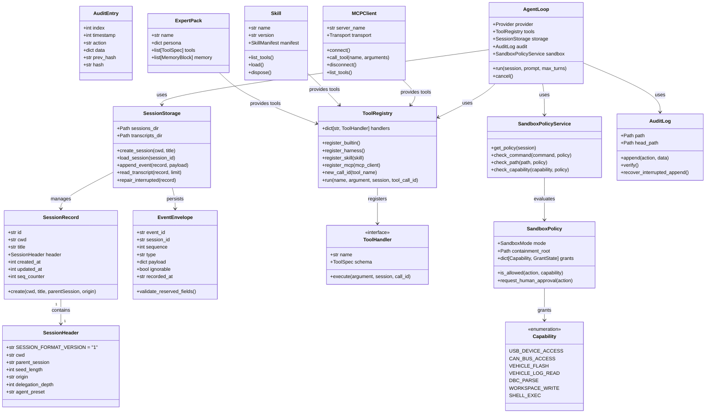
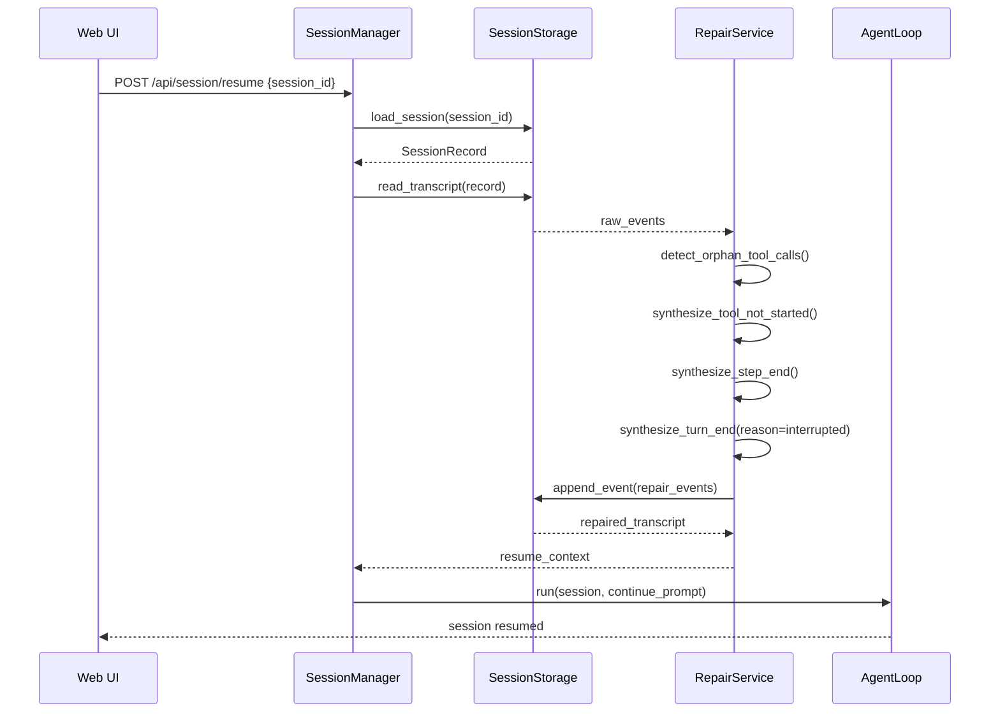
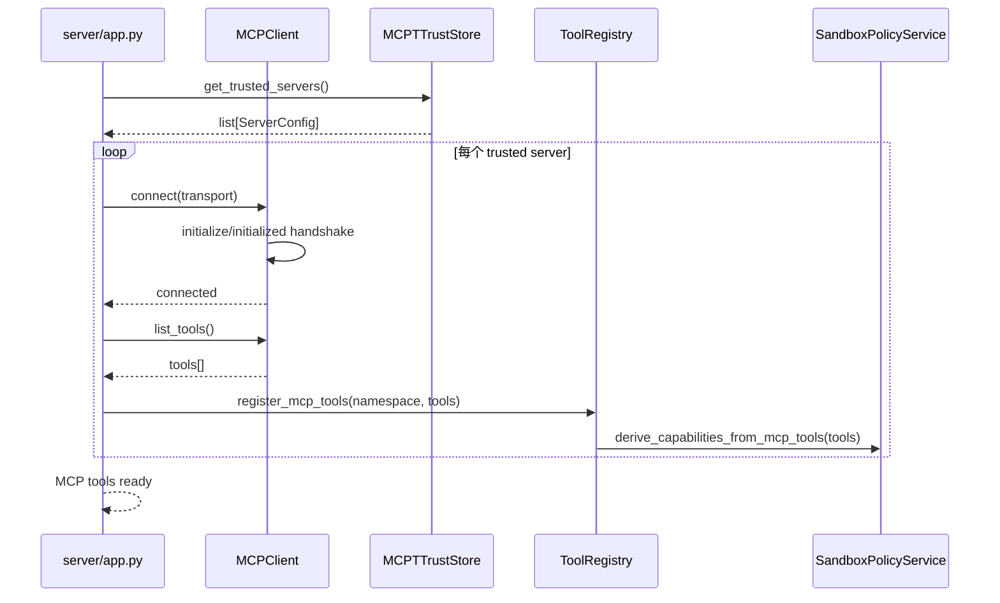
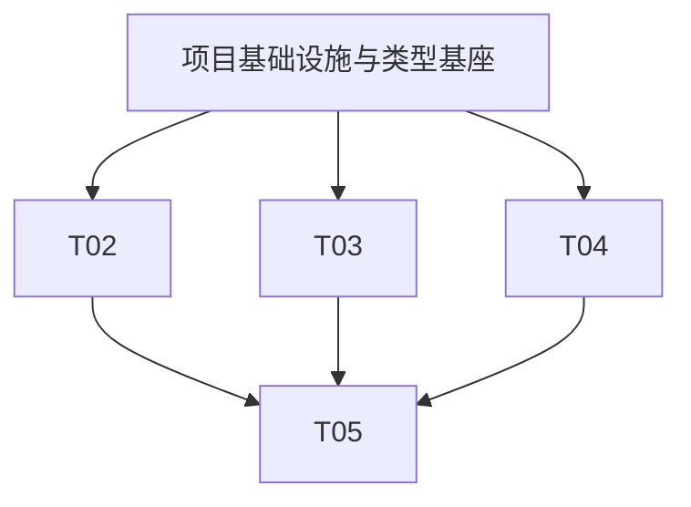

# AI OP 助手增强版系统架构设计 v1.0

> **对应 PRD**: `E:\sp\ai\docs\PRD-ai-op-assistant-v1.md`  
> **版本**: v1.0  
> **日期**: 2026-09-12  
> **编写**: software-architect

---

## Part A: System Design

### 1. Implementation Approach

#### 1.1 核心技术分析

本产品面临三大工程挑战：

1. **协议语义严格化**：deepseek-harness 对 session event/surface 有严格的 header、provenance、replace 语义；当前 ai 子模块实现较简化。需在保留 Python 生态兼容性的前提下，构建事件协议层。
2. **车辆场景下的安全分级**：车机环境具有行驶状态、CAN/USB/Flash 等高后果资源，不能简单复用全局沙盒开关。需要 capability + human-in-the-loop + 审计链的三层治理。
3. **扩展生态可治理**：Skill/Expert/MCP 三类扩展需要统一的 capability 声明、延迟加载和版本/生命周期管理，避免一次性加载数百工具 schema 挤爆上下文。

#### 1.2 框架与库选型

| 层级 | 选型 | 说明 |
|------|------|------|
| 运行时 | Python 3.13 + asyncio | 与现有 ai 子模块一致，aiohttp 提供 HTTP/WebSocket |
| Web 框架 | aiohttp | 复用现有 ai 子模块的 HTTP 处理；后续 P2 可迁移到 FastAPI |
| 前端（当前） | Vanilla JS | PRD 明确当前为 Vanilla JS；P2 重构为 Vite + React + MUI + Tailwind |
| 持久化 | SQLite (WAL) + JSONL | session 元数据、usage 用 SQLite；transcript 用 JSONL（与 learn-workbuddy 对齐） |
| 消息总线 | 内存 EventBus | 标准库 asyncio.Queue；未来可替换为 redis |
| LLM 接入 | 自研 Provider Adapter | 归一化 DeepSeek/OpenAI/Anthropic，支持 offline mock |
| MCP | 自研 MCPClient | 支持 stdio/HTTP transport、持久连接、bounded reconnect |
| 审计 | SHA256 hash chain | 参考 learn-workbuddy s23，本地 `audit.jsonl` + `audit.head` anchor |

#### 1.3 架构模式

- **分层架构**：UI → API Gateway → Orchestrator → Agent Loop → Tool Registry → Sandboxed Execution
- **插件化扩展**：Skill/Expert/MCP 统一作为 `CapabilityProvider`，通过 `ToolRegistry` 注册
- **事件溯源**：所有 session 变更写入 JSONL transcript，resume 通过 event fold 重建状态
- **Fail-closed 安全模型**：默认拒绝，显式授权，审计留痕

---

### 2. File List

```
E:\sp\ai\docs\ARCHITECTURE-ai-op-assistant-v1.md
ai/
├── core/
│   ├── chat/
│   │   ├── runner.py                 # 聊天主入口，构建 messages，调度 AgentLoop
│   │   ├── attachments.py            # 附件解析、mime 白名单、跨 session 隔离
│   │   └── handlers.py               # chat 相关 HTTP/WS handler
│   ├── session/
│   │   ├── model.py                  # SessionRecord, SessionHeader, EventEnvelope
│   │   ├── storage.py                # JSONL transcript 读写、seq 校验、resume
│   │   ├── repair.py                 # interrupted_turn_closers 合成
│   │   └── manager.py                # SessionManager create/resume/close
│   ├── agent/
│   │   ├── loop.py                   # ReAct loop：model -> tool -> result
│   │   ├── planner.py                # 意图解析/参数 diff 生成
│   │   └── cancellation.py           # ChatCancelled 与取消边界
│   └── config/
│       ├── schema.py                 # 6 域 JSON schema
│       └── diagnose.py               # 启动诊断、GET /api/ai/config/diagnose
├── tools/
│   ├── __init__.py
│   ├── registry.py                   # ToolRegistry，统一注册内置/MCP/Skill/Expert 工具
│   ├── harness_tools.py              # F0-9: harness_tool_schemas + register_harness_handlers
│   ├── dispatch.py                   # tool dispatch map，并发执行
│   ├── spill.py                      # F0-3: post-execute spill waterfall
│   ├── schemas.py                    # 标准工具 schema 定义
│   └── vehicle/
│       ├── params.py                 # 参数读写、diff、快照
│       ├── fingerprint.py            # 指纹采集
│       ├── can_dbc.py                # CAN/DBC 分析
│       ├── health_check.py           # 开不起来分诊链
│       └── flash.py                  # 固件刷写（高后果）
├── permissions/
│   ├── __init__.py
│   ├── capability.py                 # Capability 定义与 vehicle capability 枚举
│   ├── policy.py                     # SandboxPolicy、CapabilityGrant
│   ├── service.py                    # SandboxPolicyService
│   ├── hitl.py                       # Human-in-the-loop 确认接口
│   └── vehicle_guard.py              # 行驶状态检查 vEgo/enabled
├── audit/
│   ├── __init__.py
│   ├── log.py                        # AuditLog, AuditEntry, hash chain
│   ├── head.py                       # audit.head anchor 管理
│   └── verify.py                     # audit verify CLI/API
├── extensions/
│   ├── skill/
│   │   ├── manifest.py               # SkillManifest, frontmatter 解析
│   │   ├── catalog.py                # Skill 目录扫描与版本管理
│   │   ├── loader.py                 # 按需加载、scope/disposal
│   │   └── grant.py                  # Skill capability grant
│   ├── expert/
│   │   ├── pack.py                   # ExpertPack 结构
│   │   └── loader.py                 # 整包加载
│   └── mcp/
│       ├── client.py                 # Persistent MCPClient
│       ├── transport.py              # stdio/HTTP transport
│       ├── trust.py                  # server trust/grant 管理
│       └── registry.py               # MCP 工具 namespace 注册
├── runtime/
│   ├── sidecar.py                    # sidecar 进程生命周期管理
│   ├── acp.py                        # ACP JSON-RPC adapter
│   ├── lsp.py                        # LSP provider 生命周期
│   └── workflow/
│       ├── engine.py                 # WorkflowEngine
│       ├── phase.py                  # phase/log/agent-start/end 语义
│       └── cancellation.py           # run cancellation/disposal
├── providers/
│   ├── __init__.py
│   ├── adapter.py                    # Provider 归一化接口
│   ├── anthropic.py
│   ├── openai.py
│   ├── deepseek.py
│   └── offline.py                    # offline mock provider
├── memory/
│   ├── workspace.py                  # 项目级 memory
│   ├── user.py                       # 跨项目 user memory
│   └── cloud.py                      # 远端 profile/recall
├── server/
│   ├── app.py                        # aiohttp Application 组装
│   ├── routes.py                     # REST/ACP 路由
│   └── middleware.py                 # auth、capability header、audit
├── web/
│   ├── index.html
│   ├── static/
│   │   ├── css/
│   │   └── js/
│   └── components/
│       ├── chat.js
│       ├── capability_panel.js
│       └── approval_card.js
├── scripts/
│   └── verify.py                     # 综合验证脚本
└── tests/
    ├── conftest.py
    ├── test_session_protocol.py
    ├── test_sandbox_policy.py
    ├── test_audit_chain.py
    ├── test_spill_waterfall.py
    ├── test_harness_tools.py
    └── test_vehicle_capabilities.py
```

---

### 3. Data Structures and Interfaces



---

### 4. Program Call Flow

#### 4.1 一次用户调参 prompt 的完整调用链

```mermaid
sequenceDiagram
    participant UI as Web UI
    participant API as server/routes.py
    participant SM as SessionManager
    participant SS as SessionStorage
    participant AL as AgentLoop
    participant Prov as ProviderAdapter
    participant TR as ToolRegistry
    participant Plan as Planner
    participant SB as SandboxPolicyService
    participant HITL as HumanInLoop
    parameter Veh as VehicleParams
    parameter Audit as AuditLog

    UI->>API: POST /api/chat {session_id, prompt, attachments}
    API->>SM: get_or_create_session(cwd, title)
    SM->>SS: create_session(cwd, title)
    SS-->>SM: SessionRecord
    SM-->>API: SessionRecord

    API->>API: attachments.parse(body.attachments)
    API->>AL: run(session, prompt)

    AL->>SS: append_event(user_message)
    AL->>Prov: create(system, messages, tools)
    Prov-->>AL: ModelTurn(text, tool_calls)

    loop 每次 tool call
        AL->>TR: new_call_id(tool_name)
        AL->>SS: append_event(tool_call)
        AL->>Audit: append(tool_call, data)
        AL->>TR: run(tool_name, argument, session, call_id)
        TR->>SB: check_capability(capability)
        alt capability 需要 HITL
            SB->>HITL: request_approval(action_description)
            HITL-->>SB: approved / denied
        end
        SB-->>TR: allowed / denied
        alt allowed and vehicle_flash
            TR->>Veh: write_params(diff)
            Veh->>Audit: append(flash, {hash, capability, device})
            Veh-->>TR: ToolResult
        else allowed
            TR->>Veh: read_params / generate_diff
            Veh-->>TR: ToolResult
        else denied
            TR-->>AL: PermissionError
        end
        AL->>SS: append_event(tool_result)
        AL->>Audit: append(tool_result, data)
        AL->>Prov: format_tool_results(results)
    end

    Prov-->>AL: final ModelTurn(text="")
    AL->>SS: append_event(assistant_message)
    AL->>Audit: append(assistant_message)
    AL-->>API: {answer, toolResults, audit_verified}
    API-->>UI: JSON response + SSE session_update
```

#### 4.2 Resume/Repair 调用链



#### 4.3 MCP 工具注册调用链



---

### 5. Anything UNCLEAR

基于 PRD，以下假设需在后续迭代确认：

1. **Capability 粒度**：本设计采用 PRD 列出的粗粒度 capability（`vehicle_flash` 不拆分），如后续需拆分可扩展 `Capability` 枚举。
2. **审计锚点**：先采用本地 `audit.head` anchor；sunnylink 云端锚点作为 P1/P2 扩展。
3. **前端范围**：M1-M4 周期内保持 Vanilla JS，P2 再启动 React/Electron 重构。
4. **MCP 可见性**：默认未配置 server 的工具不注册到 `ToolRegistry`（隐藏而非 DENY）。
5. **HITL 触发条件**：除固件刷写、控制报文外，暂不将"批量参数写入"纳入强制确认，保持 PRD 原始范围。
6. **AgentLoop 默认开启**：先对 `op chat` / Web 开启，定时任务/自动化后续灰度。
7. **与 commaai 官方策略**：capability 列表需安全/法务 review，本设计保留扩展点。

---

## Part B: Task Decomposition

### 6. Required Packages

```
- python>=3.13: 运行时
- aiohttp>=3.9: Web 框架、HTTP/WebSocket
- aiohttp-jinja2: 模板（可选）
- aiosqlite>=0.20: SQLite 异步访问
- pydantic>=2.5: schema 校验、配置模型
- pyyaml>=6.0: SKILL.md frontmatter、配置解析
- python-dotenv>=1.0: 环境变量
- anthropic>=0.25.0: Anthropic SDK
- openai>=1.40.0: OpenAI SDK
- pytest>=8.0.0 + pytest-aiohttp: 测试
- pytest-asyncio: 异步测试
- jsonschema>=4.0: 6 域配置 schema 校验
```

P2 前端迁移时增加：
```
- react@^18.2.0
- @mui/material@^5.14.0
- vite@^5.0.0
- tailwindcss@^3.4.0
```

---

### 7. Task List

| Task ID | Task Name | Source Files | Dependencies | Priority |
|---------|-----------|--------------|--------------|----------|
| T01 | **项目基础设施与类型基座** | `pyproject.toml`, `requirements.txt`, `core/session/model.py`, `core/config/schema.py`, `tools/schemas.py`, `server/app.py` | - | P0 |
| T02 | **Session 协议、Storage 与 Resume/Repair** | `core/session/storage.py`, `core/session/repair.py`, `core/session/manager.py`, `tests/test_session_protocol.py` | T01 | P0 |
| T03 | **AgentLoop、Provider Adapter 与 Harness 工具注册** | `core/agent/loop.py`, `providers/*.py`, `tools/harness_tools.py`, `tools/registry.py`, `tests/test_harness_tools.py` | T01 | P0 |
| T04 | **Capability、SandboxPolicy、HITL 与车辆安全守卫** | `permissions/capability.py`, `permissions/policy.py`, `permissions/service.py`, `permissions/hitl.py`, `permissions/vehicle_guard.py`, `tools/vehicle/*.py`, `tests/test_sandbox_policy.py`, `tests/test_vehicle_capabilities.py` | T01 | P0 |
| T05 | **Spill Waterfall、Audit Hash Chain与集成** | `tools/spill.py`, `audit/log.py`, `audit/head.py`, `audit/verify.py`, `core/chat/runner.py`, `core/chat/attachments.py`, `server/routes.py`, `tests/test_spill_waterfall.py`, `tests/test_audit_chain.py` | T02, T03, T04 | P0 |

---

### 8. Shared Knowledge

- **Event ID 格式**: `transcript:{session_id}:{sequence}`，必须全局唯一。
- **SessionHeader 必填字段**: `SESSION_FORMAT_VERSION`, `cwd`, `parent_session`, `seed_length`, `origin`, `delegation_depth`, `agent_preset`。
- **Capability 求交原则**: 运行时有效权限 = `Harness base grants` ∩ `Skill manifest grants` ∩ `User capability grant`。
- **Fail-closed 默认**: 未知工具、未声明 capability、无法解析命令、路径逃逸统一拒绝并审计。
- **审计 payload 必须包含**: `session_id`, `tool_call_id`, `capability`, `device_handle`（如适用）, `firmware_hash`（如适用）。
- **Spill 阈值**: `ai_externalize_threshold` 默认 50KB；`ai_compaction_max_tokens` 默认 32768。
- **附件隔离**: 附件内容按 session 临时目录存储，mime 白名单限制，每附件字符上限可配置。
- **Tool call ID 格式**: `call_{name}_{timestamp_ns}_{counter}`，用于审计与外部化文件命名。
- **MCP namespace**: `mcp__{server_name}__{tool_name}`。

---

### 9. Task Dependency Graph



---

*本文档为 architecture 设计输出，后续由 software-engineer 按 Task List 实施。*
