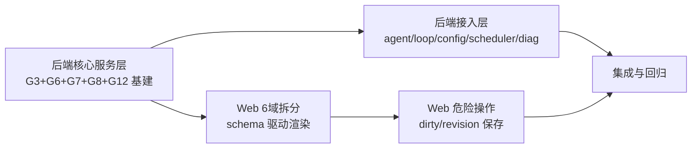

# 增量架构设计与任务分解 — G3/G6/G7/G8/G12 + Web 设置页重构

- 架构师：高见远（software-architect）
- 上游输入：`docs/GAP-vs-dsh-latest.md` + `artifacts/ai_vs_harness_对比审计与Web设置页优化分析_2026-09-05.md`
- 范围：仅落地以下未闭合项（已闭合项 G1 Spill、G2 Goal 事件投影、G4 AgentLoop public seam、G5 LSP 错误码、MCP 持久化 **不重复设计**）
- 基准代码库：`E:\sp\ai`（Python 3.12 + aiohttp + 原生 JS 前端）
- 验证约束：无 scons / cereal / libparams_c.so；仅能针对 `ai/` 用 `unittest`（入口 `ai.tests.bootstrap_pc`）验证；新增代码必须可独立测试。

---

## Part A — 系统设计

### 1. 实施思路

**技术难点**：
1. **G3 Compaction**：ai 已有两个半成品——`core/chat/compaction.py`（基于 Params 配置的 LLM 摘要压缩）与 `core/session/pruner.py`（已落地 G3 的 tool-result pruner 半段）。缺的是：把压缩改造成 dsh 式**事件投影驱动的 compaction seam**（`compaction/start→summary→end` + 锁 + shadowedRange/shadowedSeqs/tokenCount），并把 `maybe_compact_messages` 从"改内存 messages"升级为"对 SessionLog 做 surface REPLACE"。为避免过度工程，本次采用**双轨**：保留轻量 `maybe_compact_messages`（内存层，已测），新增 `core/session/compaction.py`（日志层投影，对照 dsh compaction-basic），二者共用 `context_config` 阈值。
2. **G6 Scheduler**：ai 已有 **Web/offroad 定时任务**（`tools/domains/platform/scheduler.py` + `tools/scheduler.py` 别名 + `server/handlers/scheduler_handlers.py`，trigger 为 `interval/on_offroad/on_wifi/daily_at`）。dsh 的 G6 是 **agent 级 at/cron/every 工具**。两者必须**隔离**：新建 `tools/domains/agent_scheduler.py`（agent 工具注册 + 内存事件循环调度器），不触碰现有 Web scheduler。用纯 Python `asyncio` + `croniter`-like 语义实现（避免新依赖，手写 cron 解析或可选引入 `croniter`，见包清单）。
3. **G7 Subagent capability matrix + lineage**：`subagent/capabilities.py` 与 `runner.py` 的 SUBAGENT_START/END 事件已有雏形。缺的是：**capability 在 run 前的强制校验接入点**（runner 需调用 `validate_request`）、**lineage 树查询/持久化**（parent→child 可回放）、**父 session policy/cwd/权限继承**。
4. **G8 Profile patch composition**：ai 有 `bundle/`（zip+manifest+原子安装）与 `core/profiles/`（ProfileManager）。缺 dsh 的**有序 patch 层合成**（ordered bundles → bundle patch → profile patch → launcher patch，原子回滚）。新增 `bundle/profile_compose.py`，复用 bundle.manifest 与 profile.manager。
5. **G12 集中 config schema + 启动诊断 + 稳定错误码**：ai 靠 `_PARAMS._put` + 函数级 try/except 静默回退，无 schema。新建 `config/schemas/*.json` + `config/registry.py`（schema 注册/校验）+ `core/diagnostics.py`（启动依赖诊断）+ 复用 `core/errors.py` 错误码。这是 Web schema 驱动渲染的后端基础。

**架构模式**：分层（domain / service / adapter）+ 事件投影（compaction）+ 注册表模式（schema、provider、settings）。不引入新 web 框架；前端沿用原生 JS，新增 `settings/` 模块目录做 schema 驱动渲染。

**框架选型**：
- 后端：标准库 `asyncio`/`dataclasses`/`json`；可选 `croniter`（G6 cron 解析，若允许新依赖）；复用 `aiohttp`。
- 前端：原生 JS ES2020 模块（`web/static/js/settings/`），无构建链，遵循现有 `WebApi.api()` 约定。
- 测试：`unittest`（参照 `tests/` 现有命名 `test_*.py`，`import ai.tests.bootstrap_pc`）。

---

### 2. 文件清单（新增/修改）

> 标注：`[新]`=新增，`[改]`=修改，`[移]`=移动/收敛。

**G3 Compaction**
```
[新] E:\sp\ai\core\session\compaction.py          # dsh compaction-basic 日志层投影 seam
[新] E:\sp\ai\core\session\tests\test_compaction.py
[改] E:\sp\ai\core\agent\agent.py                 # run_with_loop/run 中调用 compact_if_needed（pre-turn）
[改] E:\sp\ai\core\agent\loop.py                  # _step 前接入 compaction seam（pre-step waterfall）
[改] E:\sp\ai\core\chat\compaction.py             # 收敛：复用 core/session/compaction，保留 maybe_compact_messages 薄封装
[改] E:\sp\ai\core\session\pruner.py              # 已存在；补充被 compaction 调用的公共入口（prune_if_needed）
```

**G6 Agent Scheduler**
```
[新] E:\sp\ai\tools\domains\agent_scheduler.py    # agent 级 at/cron/every 调度器 + 工具注册
[新] E:\sp\ai\tools\domains\scheduler_cron.py     # 纯 Python cron 解析（或 croniter 适配层）
[新] E:\sp\ai\tools\domains\tests\test_agent_scheduler.py
[改] E:\sp\ai\tools\harness_tools.py              # 注册 at/cron/every/list_schedules/cancel_schedule 工具
[改] E:\sp\ai\server\handlers\scheduler_handlers.py # 新增 /api/ai/agent-schedule 子路由（与现有 Web scheduler 隔离）
[改] E:\sp\ai\server\app_factory.py               # 注册新 handler 路由（如需要）
```

**G7 Subagent capability + lineage**
```
[改] E:\sp\ai\subagent\runner.py                  # run_subagent 前调用 validate_request/validate_depth，返回结构化拒绝
[改] E:\sp\ai\subagent\pool.py                    # lineage 索引：parent→children 查询；task 创建时记录 parentId/depth/origin
[新] E:\sp\ai\subagent\lineage.py                 # SubagentLineage 树 + 事件投影重建（SUBAGENT_START/END fold）
[新] E:\sp\ai\subagent\tests\test_lineage.py
[改] E:\sp\ai\subagent\models.py                  # SubagentTask 增加 lineage 字段（origin/delegationDepth）序列化
[改] E:\sp\ai\subagent\providers.py               # get_provider 时校验；补充各 provider 真实 capability（ACP/Codex/fork）
```

**G8 Profile patch composition**
```
[新] E:\sp\ai\bundle\profile_compose.py           # ordered bundles + patch 层合成 + 原子回滚 + 冲突诊断
[新] E:\sp\ai\bundle\tests\test_profile_compose.py
[改] E:\sp\ai\bundle\manifest.py                  # 增加 dsh.bundle.patch / profile.bundles 解析（向后兼容）
[改] E:\sp\ai\bundle\loader.py                    # 安装后生成 bundle 的 patch 层清单
[改] E:\sp\ai\core\profiles\manager.py            # 提供 compose 结果的接入点（可选用）
[改] E:\sp\ai\server\handlers\bundle_handlers.py  # 暴露 compose 预览/诊断（P2，可选）
```

**G12 Config schema + 诊断 + 错误码**
```
[新] E:\sp\ai\config\__init__.py
[新] E:\sp\ai\config\registry.py                  # ConfigRegistry：schema 注册/查找/合并
[新] E:\sp\ai\config\validator.py                 # validate_payload(schema, payload) → errors
[新] E:\sp\ai\config\schemas\conversation.json
[新] E:\sp\ai\config\schemas\evolution.json
[新] E:\sp\ai\config\schemas\vehicle_safety.json
[新] E:\sp\ai\config\schemas\data_backup.json
[新] E:\sp\ai\config\schemas\agent_scheduler.json
[新] E:\sp\ai\config\schemas\dev_diagnostics.json
[新] E:\sp\ai\config\schemas\index.json             # 汇总 + 每 schema revision
[新] E:\sp\ai\core\diagnostics.py                  # 启动依赖诊断 + 稳定错误码聚合
[新] E:\sp\ai\core\tests\test_diagnostics.py
[新] E:\sp\ai\config\tests\test_registry.py
[新] E:\sp\ai\config\tests\test_validator.py
[改] E:\sp\ai\server\handlers\config_handlers.py   # api_get_config 由 schema 驱动输出；api_post_config 按 schema 校验
[改] E:\sp\ai\server\handlers\api.py               # 挂 schema/诊断 endpoint（或新 routes）
[改] E:\sp\ai\server\routes\agents.py              # 增加 /api/ai/config/schema、/api/ai/config/diagnose（示例）
[改] E:\sp\ai\aid.py                               # 启动时调用 core.diagnostics.run_startup_diagnostics()
```

**Web 设置页重构**
```
[新] E:\sp\ai\web\static\js\settings\registry.js     # SettingsRegistry：domain→schema/card 注册、搜索
[新] E:\sp\ai\web\static\js\settings\render.js       # schema 驱动渲染（字段/类型/默认/secret/restart）
[新] E:\sp\ai\web\static\js\settings\save.js         # 每卡片 dirty/revision/局部保存
[新] E:\sp\ai\web\static\js\settings\dangerous.js    # 预览→确认→审计 三步
[新] E:\sp\ai\web\static\js\settings\search.js       # 设置搜索
[新] E:\sp\ai\web\static\js\settings\index.js        # 模块入口，暴露有限全局 API
[改] E:\sp\ai\web\static\js\ai.js                   # 设置抽屉改为 6 域注册渲染；接入 settings/ 模块
[改] E:\sp\ai\web\static\js\web-api.js              # 增加 configApi（schema/patch/diagnose）薄封装
[改] E:\sp\ai\web\static\index.html                 # 6 域 Tab + 搜索框 + settings 根容器（保留现有 pane 内容迁移）
[改] E:\sp\ai\web\static\css\*.css                  # 卡片/搜索/危险操作样式（或复用现有）
[新] E:\sp\ai\web\static\js\settings\render.test.html # 纯前端冒烟（可选，非单测）
```

---

### 3. 数据结构与接口（Mermaid classDiagram 摘要）

完整图见 `docs/class-diagram.mermaid`。关键接口签名：

```python
# --- G3 core/session/compaction.py ---
class CompactionConfig:  # 复用 common/context_config 阈值
  threshold_ratio: float = 0.8
  retain_ratio: float = 0.16
  max_tokens: int = 0

@dataclass
class CompactionResult:
  compaction_id: str
  summary: str
  shadowed_seqs: list[int]        # 表面被 shadow 的 seq，表面序
  shadowed_token_count: int
  replacement_seq: int | None     # 生成的 user/message REPLACE seq（None=无替换）

class CompactionService:
  def __init__(self, session_log: SessionLog, llm_stream: Any, config: CompactionConfig) -> None: ...
  async def compact_if_needed(self, agent, trigger: str = "pressure", signal=None) -> CompactionResult | None: ...
  async def compact_now(self, agent, signal=None) -> CompactionResult | None: ...
  def _emit_lifecycle(self, kind: str, payload: dict) -> None: ...  # compaction/start|summary|end 事件

# --- G6 tools/domains/agent_scheduler.py ---
@dataclass
class SchedulerJob:
  id: str
  agent_id: str
  spec: str            # "at 14:30" / "cron 0 9 * * *" / "every 5m"
  kind: str            # at | cron | every
  payload: dict
  enabled: bool = True

class AgentScheduler:
  def __init__(self, params) -> None: ...
  def schedule(self, agent_id: str, spec: str, payload: dict) -> dict: ...   # 返回 {ok, job}
  def cancel(self, job_id: str) -> bool: ...
  def list(self, agent_id: str) -> list[dict]: ...
  async def _tick(self) -> None: ...   # asyncio 事件循环，到期触发 agent 工具

def register_agent_scheduler_tools(handlers: dict) -> None: ...  # 注册 at/cron/every/list/cancel

# --- G7 subagent/lineage.py ---
class SubagentLineage:
  def __init__(self) -> None: ...
  def add_edge(self, parent_task: str, child_task: str, run_id: str, depth: int, origin: str) -> None: ...
  def children(self, parent_task: str) -> list[dict]: ...
  def roots(self) -> list[str]: ...
  def rebuild_from_events(self, events: list[dict]) -> None: ...   # SUBAGENT_START/END fold

# --- G8 bundle/profile_compose.py ---
@dataclass
class PatchLayer:
  order: int
  source: str          # bundle id | profile | launcher
  operations: list[dict]

class ProfileComposer:
  def __init__(self, bundle_loader: BundleLoader, profile_manager: ProfileManager) -> None: ...
  def compose(self, profile_id: str, bundles: list[str]) -> tuple[dict, list[str]]: ...  # (merged_config, conflict_msgs)
  def preview(self, profile_id: str, bundles: list[str]) -> list[PatchLayer]: ...

# --- G12 config/registry.py + validator.py ---
@dataclass
class SchemaField:
  key: str
  type: str            # string|number|boolean|enum|secret|list|object
  default: Any = None
  min: float | None = None
  max: float | None = None
  enum: list | None = None
  secret: bool = False
  restart: bool = False

class ConfigRegistry:
  def register_schema(self, namespace: str, fields: dict[str, SchemaField], revision: int) -> None: ...
  def get_schema(self, namespace: str) -> dict: ...
  def all(self) -> dict: ...

def validate_payload(schema: dict, payload: dict) -> list[dict]:   # [{field, code, message}]

# --- Web settings/ ---
class SettingsRegistry { register(domain, schema, cards); search(query); get(domain) }
class SettingsCard   { namespace; schema; dirty; revision; save(); restore_default() }
class DangerousAction { preview(args) → Preview; confirm(token) → AuditEntry }
```

**错误码**（复用并扩展 `core/errors.py`）：
- 复用：`ERR_INVALID_INPUT`、`ERR_STALE_REVISION`、`ERR_BLOCKED`、`ERR_NOT_FOUND`、`ERR_DEPENDENCY`。
- 新增常量（放入 `core/errors.py`）：`ERR_CONFIG_INVALID`、`ERR_CONFIG_STALE`、`ERR_SCHEDULE_INVALID`、`ERR_SUBAGENT_CAPABILITY`、`ERR_PROFILE_CONFLICT`、`ERR_STARTUP_DIAG`。

---

### 4. 程序调用流程

见 `docs/sequence-diagram.mermaid`。核心流程：

1. **设置读取**：`UI → GET /api/ai/config/schema → ConfigRegistry.get_schema → {ok,data,message}`。
2. **局部保存**：`UI → PATCH /api/ai/config (namespace, payload, revision) → validate_payload → 写 Params → 返回新 revision`；冲突返回 `ERR_CONFIG_STALE`。
3. **Compaction**：`AgentLoop._step → CompactionService.compact_if_needed → pruner + summarizer → SessionLog surface REPLACE + compaction/* 事件`。
4. **Agent schedule**：`UI/Agent → POST /api/ai/agent-schedule → AgentScheduler.schedule → SchedulerJob → asyncio tick → 触发工具`。
5. **Subagent**：`SubagentPool.run → validate_request → validate_depth → run_subagent → SUBAGENT_START 事件 → runner → SUBAGENT_END → lineage.add_edge`。
6. **危险操作**：`UI → POST preview → 返回 preview token/audit diff → UI 展示 → POST confirm(token) → 执行 + append audit → 返回结果`。

---

### 5. 未明确项 / 假设

- **G3 摘要用哪个 LLM**：假设复用 `core/llm/model_router.chat_completion_with_failover` 的 stream；无 LLM 时 `compact_now` 只做 pruner 修剪（跳过 summarizer），保证可离线测试。
- **G6 是否允许新依赖 `croniter`**：假设**优先纯 Python 实现**（`scheduler_cron.py` 覆盖常见 `* * * * *` 5 字段），避免依赖冲突；若团队同意可改用 croniter。此点需 PM/主理人裁决。
- **G7 父 policy 继承范围**：默认只继承 `session_id/cwd/workspaceRoot/depth` 标量，不继承 secret；ACP/Codex provider 的 cwd/权限继承作为 P1（外部依赖 G13/G14 受阻）。
- **G8 profile patch 是否真的需要写盘应用**：本次仅实现**合成 + 冲突诊断 + 预览**（幂等、可测），不修改运行中进程配置；"应用"作为 P2（需启动期 hook）。
- **Web 6 域与现有 pane 的关系**：现有 `index.html:416-1154` 大量 DOM 直接绑定 JS；本次为**渐进迁移**——6 域导航 + schema 渲染新卡片，旧 pane 内容按域分组收纳，`ai.js` 中对应的旧渲染函数保留为兼容 fallback，避免一次性重写 8641 行。
- **配置 key 与 schema 的映射**：以 `common/params.ITEMS` 中 `ai_*` 为准；schema 只覆盖 6 域所涉 key，未列 key 保持现状（不强制全量迁移）。

---

## Part B — 任务分解

### 6. 所需包

```
- Python（均标准库优先，仅后端；沿用 openpilot/aiohttp 现有依赖）
- asyncio / dataclasses / json / pathlib / unittest        # 内置
- aiohttp@现有版本                                          # 已有
- openpilot.common.params, openpilot.common.swaglog        # 已有
- croniter==5.x（可选，G6 cron 解析；默认纯 Python 实现）
- （前端无新依赖，沿用原生 JS + WebApi.api()）
```

### 7. 任务清单（按依赖排序，≤5 个）

> 分组原则：后端数据/服务层 → 后端接入层 → 前端 Web 层 → 集成。任务间尽量并行、仅依赖 T01 基础。

| ID | 名称 | 源文件 | 依赖 | 优先级 |
|----|------|--------|------|--------|
| **T01** | 后端核心服务层（G3+G6+G7+G8 纯逻辑 + G12 基建） | `core/session/compaction.py`, `core/session/tests/test_compaction.py`, `core/session/pruner.py`, `tools/domains/agent_scheduler.py`, `tools/domains/scheduler_cron.py`, `tools/domains/tests/test_agent_scheduler.py`, `subagent/lineage.py`, `subagent/tests/test_lineage.py`, `subagent/models.py`, `bundle/profile_compose.py`, `bundle/tests/test_profile_compose.py`, `config/__init__.py`, `config/registry.py`, `config/validator.py`, `config/schemas/*.json`, `config/tests/test_registry.py`, `config/tests/test_validator.py`, `core/errors.py` | — | P0 |
| **T02** | 后端接入层（agent/loop/config/scheduler/subagent provider 接线 + 启动诊断） | `core/agent/agent.py`, `core/agent/loop.py`, `core/chat/compaction.py`, `subagent/runner.py`, `subagent/pool.py`, `subagent/providers.py`, `tools/harness_tools.py`, `server/handlers/config_handlers.py`, `server/handlers/scheduler_handlers.py`, `server/routes/agents.py`, `aid.py`, `core/diagnostics.py`, `core/tests/test_diagnostics.py` | T01 | P0 |
| **T03** | Web 设置页 6 域拆分 + schema 驱动渲染（前端，可与 T02 并行） | `web/static/js/settings/registry.js`, `render.js`, `save.js`, `search.js`, `index.js`, `web/static/js/ai.js`, `web/static/js/web-api.js`, `web/static/index.html`, `web/static/css/*.css` | T01 | P1 |
| **T04** | Web 危险操作「预览→确认→审计」+ 每卡片 dirty/revision 保存语义（前端，依赖 T03 渲染框架） | `web/static/js/settings/dangerous.js`, `save.js`, `web/static/js/ai.js`, `web/static/index.html`, `server/handlers/config_handlers.py`(审计/预览 endpoint) | T03 | P1 |
| **T05** | 集成与回归：路由注册核对、错误码一致性、unittest 全量回归、启动诊断冒烟 | `core/errors.py`, `config/schemas/index.json`, `server/routes/agents.py`, `aid.py`, `tests/*`（回归）, `config/tests/*`, `core/session/tests/test_compaction.py`, `subagent/tests/test_lineage.py`, `bundle/tests/test_profile_compose.py`, `tools/domains/tests/test_agent_scheduler.py` | T02, T04 | P0 |

---

### 8. 共享知识（跨文件约定）

- **响应格式**：所有 API 返回 `{ok: bool, data?: any, message?: string, error_code?: string}`；错误用 `core/errors.py` 稳定 code，禁止裸字符串。
- **错误码**：统一 `core/errors.py`；新增 `ERR_CONFIG_INVALID/ERR_CONFIG_STALE/ERR_SCHEDULE_INVALID/ERR_SUBAGENT_CAPABILITY/ERR_PROFILE_CONFLICT/ERR_STARTUP_DIAG`。
- **配置 key**：沿用 `ai_*` 前缀 + `common/params.ITEMS`；schema 的 field.key 即 Params key。
- **事件命名**：compaction 事件 `compaction/start|summary|end`；subagent 事件 `SUBAGENT_START|END`（已存在，保持向后兼容）。
- **surface 语义**：REPLACE 走 `SurfaceOp` + `source_seqs` 溯源（复用 `core/session/log.py` 与 pruner）。
- **前端**：用 `WebApi.api(method, path, body)`；新模块只暴露有限全局（`SettingsApp`），不污染 `window`；6 域命名 `conversation/evolution/vehicle/data_backup/scheduler/dev_diagnostics`。
- **日期**：时间戳用 `int(epoch)`（SchedulerJob.last_run）或 ISO8601 UTC（审计条目）。
- **测试**：每个新增 py 模块配 `tests/test_*.py`，`import ai.tests.bootstrap_pc`；纯逻辑（compaction/pruner/scheduler/lineage/compose/registry/validator）必须可脱离 openpilot 运行。

---

### 9. 任务依赖图



- 并行分组：**组 A = {T01}**（先决）；**组 B = {T02, T03}**（依赖 T01，彼此可并行）；**组 C = {T04}**（依赖 T03）；**组 D = {T05}**（汇总）。
- 关键依赖：T02 需 T01 的服务类；T03/T04 需 T01 的 schema registry；T05 收口所有。

---

### 验收标准

- **T01**：`core/session/tests/test_compaction.py`、`subagent/tests/test_lineage.py`、`bundle/tests/test_profile_compose.py`、`config/tests/test_registry.py`、`config/tests/test_validator.py`、`tools/domains/tests/test_agent_scheduler.py` 全部通过；compaction/pruner 无 LLM 时仍可离线修剪；lineage 可折叠 SUBAGENT_START/END 重建树；profile_compose 对冲突 patch 返回结构化诊断；registry/validator 对越界/未知 key 返回稳定错误码。
- **T02**：AgentLoop pre-step 接入 compaction seam，压缩后 surface 只做一次 REPLACE；`/api/ai/config` 读由 schema 驱动、写经 `validate_payload`，非法 key/越界返回 `ERR_CONFIG_INVALID`，revision 冲突返回 `ERR_CONFIG_STALE`；`/api/ai/agent-schedule` 与现有 Web scheduler 路由不冲突；`aid.py` 启动调用 `run_startup_diagnostics()` 不抛未捕获异常。
- **T03**：设置页 6 域导航可达；普通用户默认不暴露 `dev_diagnostics` 域；每卡片 schema 渲染（类型/默认/范围/secret/restart）；搜索按 label/key 命中并展开高亮。
- **T04**：危险操作统一「预览→确认→审计」，审计条目落盘可查；每卡片独立 dirty 状态与局部保存，revision 冲突时前端提示而非覆盖。
- **T05**：`python -m unittest discover` 对 `ai/` 全量回归通过（含既有 29+ 项与新增用例）；新增错误码在 API 响应可稳定复现；无 scons/cereal 依赖。
```
