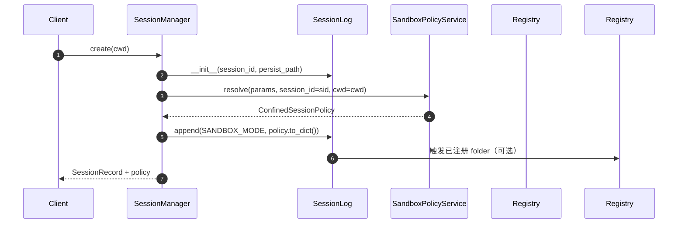
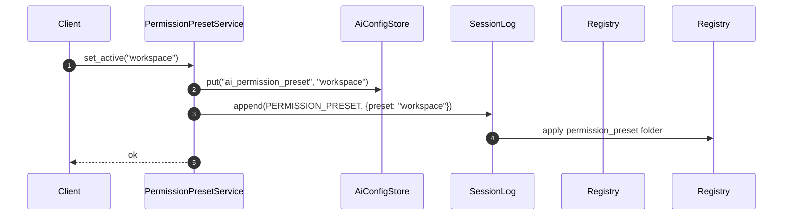
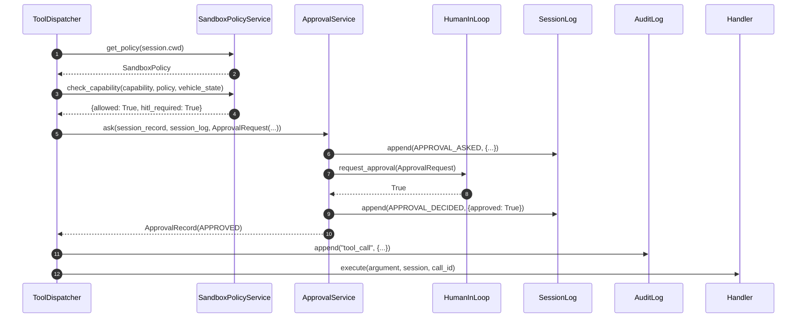
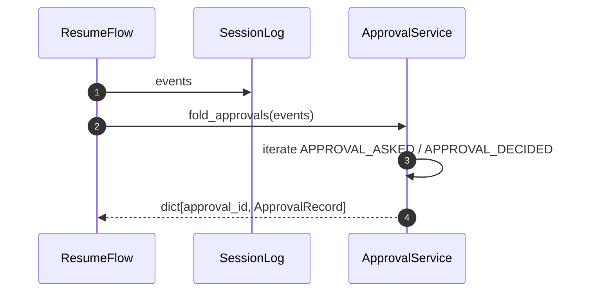
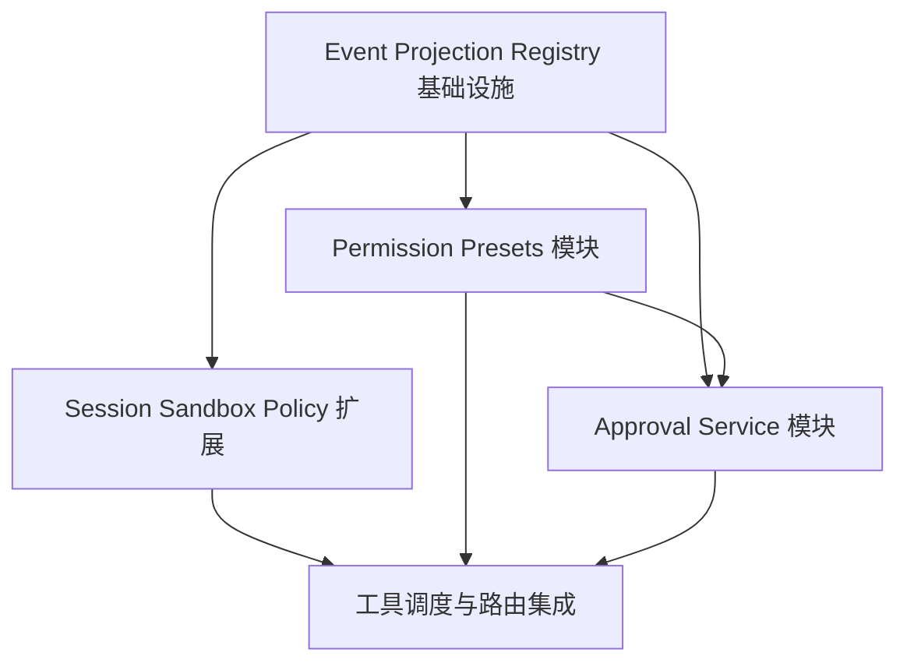

# P0 基础框架架构设计文档

> **范围**：`E:\sp\ai` 子仓库新增四个独立模块
> - Event Projection Registry
> - Session Sandbox Policy
> - Permission Presets
> - Approval Service
> **约束**：只输出设计文档，不修改现有文件；新增模块完全独立、不破坏生产代码、本地 dev 模式可跑通。

---

## Part A: System Design

### 1. Implementation Approach

#### 1.1 核心挑战

| 挑战 | 说明 | 设计对策 |
|------|------|----------|
| 两条事件流并存 | `ai/core/session/log.py` 使用 `SessionEvent` + `EventType`（严格 surface 语义）；`ai/core/session/model.py` 使用 `EventEnvelope` + `EventType`（Record/Storage 层） | 新事件类型统一追加到 `log.py` 的 `EventType`，并通过投影注册表同时支持对 `SessionEvent` 与 `EventEnvelope` 的 fold；Storage 层在落盘时做无损转换 |
| 会话级沙盒可重放 | 现有 `SandboxPolicyService` 是全局配置驱动，缺少 session override 与 runtime-context snapshot | 扩展 `ConfinedSessionPolicy` 携带 `mode/cwd/containment_root`，并在 `request/context` 事件写入时快照 |
| 权限预设需持久化 | Capability policy 当前只从 `AIOPConfig` 读取，缺少用户可切换的 preset | 引入 `PermissionPreset` 与 `PermissionPresetService`，持久化复用 `AiConfigStore` |
| HITL 标准化 | 现有 `HumanInLoop` 是内存回退，缺少标准 `approval/asked` + `approval/decided` 事件 | 新增 `ApprovalService` 包装 HITL，所有高后果动作必须先生成审批事件 |
| 车辆安全守卫 | 行车状态需拦截写操作 | `ApprovalService` 与 `ToolDispatcher` 集成前调用 `VehicleGuard` |

#### 1.2 技术选型

- **语言/框架**：Python 3.13，复用现有 dataclass + StrEnum 风格。
- **事件存储**：复用 `SessionLog` 的 JSONL append-only 机制，新增事件类型直接走 `SessionLog.append()`。
- **持久化**：权限预设使用 `ai/common/config_store.py` 的 `AiConfigStore`。
- **测试**：pytest，沿用 `PYTHONPATH=E:\sp\ai` 运行；新模块全部纯 Python，不依赖车机参数目录。

#### 1.3 架构模式

- **Event Sourcing / Fold Pattern**：`SessionLog` 为唯一事件源，状态通过 `EventProjectionRegistry` 注册的 folder 从事件序列派生。
- **Policy-as-Event**：沙盒模式与权限预设变更均写入事件日志，保证 resume 后可重放。
- **Capability-based Access Control**：`Capability` × `GrantState` × `PermissionPreset` 三维求交得到运行时授权。
- **HITL 事件化**：审批请求与决定都是不可变事件，审计可追踪。

---

### 2. File List

```
E:\sp\ai
├── core
│   └── session
│       ├── log.py                  # 现有：追加 EventType 扩展（只读设计，不修改文件本身）
│       ├── folds.py                # 现有：扩展 fold_domain_events 能力
│       └── projections.py          # 新增：Event Projection Registry
├── sandbox
│   ├── runtime.py                  # 现有：扩展 session override / snapshot
│   └── tests
│       └── test_policy_service.py  # 现有：新增用例
├── permissions
│   ├── policy.py                   # 现有：CapabilityGrant / SandboxPolicy
│   ├── capability.py               # 现有：Capability 枚举
│   ├── vehicle_guard.py            # 现有：VehicleState / VehicleGuard
│   ├── hitl.py                     # 现有：HumanInLoop / ApprovalRequest
│   ├── service.py                  # 现有：SandboxPolicyService
│   ├── presets.py                  # 新增：PermissionPreset / PermissionPresetService
│   ├── approval.py                 # 新增：ApprovalService / ApprovalState
│   └── tests
│       ├── test_presets.py         # 新增
│       └── test_approval.py        # 新增
├── tools
│   ├── dispatch.py                 # 现有：ToolDispatcher 接入 ApprovalService
│   └── schemas.py                  # 现有：ToolSpec 增加 hitl_required 标记
├── server
│   └── op_routes.py                # 现有：新增 /api/ai/permissions/* 路由
└── docs
    ├── system_design_p0_framework.md   # 本文件
    ├── class-diagram.mermaid           # 类图
    └── sequence-diagram.mermaid        # 序列图
```

---

### 3. Data Structures and Interfaces

```mermaid
classDiagram
    direction TB

    class EventType {
        <<enumeration>>
        TURN_START
        ...
        GOAL_CHANGE
        PLAN_CHANGE
        TODO_CHANGE
        SCHEDULE_CHANGE
        SANDBOX_MODE
        PERMISSION_PRESET
        APPROVAL_ASKED
        APPROVAL_DECIDED
        COMMAND_RUN
        COMMAND_DONE
    }

    class SessionEvent {
        +EventType type
        +int seq
        +int time
        +Any data
        +SurfaceOp|None surface_op
        +tuple[int]|None source_seqs
        +to_dict() dict
    }

    class EventEnvelope {
        +str event_id
        +str session_id
        +int sequence
        +str type
        +dict payload
        +bool ignorable
        +str recorded_at
        +to_dict() dict
        +from_dict(data) EventEnvelope
    }

    class ProjectionFolder~T~ {
        <<callable>>
        +name: str
        +zero: T
        +event_types: set[str]
        +apply(state: T, event: SessionEvent) T
    }

    class EventProjectionRegistry {
        -dict[str, ProjectionFolder] _folders
        +register(folder) None
        +unregister(name) None
        +fold(events, projection) Any
        +fold_all(events) dict[str, Any]
        +supported_types() set[str]
    }

    class SandboxMode {
        <<enumeration>>
        READ_ONLY
        WORKSPACE_WRITE
        DANGER_FULL_ACCESS
    }

    class ConfinedSandboxMode {
        <<literal>>
        "read-only" | "workspace-write"
    }

    class ConfinedSessionPolicy {
        +str session_id
        +ConfinedSandboxMode mode
        +str containment_root
        +to_context() dict
        +to_dict() dict
    }

    class SandboxPolicyService {
        +ConfinedSandboxMode DEFAULT_MODE
        +str MODE_PARAM
        -str workspace_root
        +resolve(params, session_id, cwd) ConfinedSessionPolicy
        +contained_cwd(requested) str
        -_resolve_mode(params) ConfinedSandboxMode
    }

    class Capability {
        <<enumeration>>
        USB_DEVICE_ACCESS
        CAN_BUS_ACCESS
        VEHICLE_FLASH
        VEHICLE_LOG_READ
        DBC_PARSE
        WORKSPACE_WRITE
        SHELL_EXEC
        +all() set~str~
    }

    class GrantState {
        <<enumeration>>
        ALLOWED
        ASK
        DENIED
    }

    class CapabilityGrant {
        +str capability
        +GrantState state
        +str source
        +str reason
        +to_dict() dict
    }

    class SandboxPolicy {
        +SandboxMode mode
        +Path containment_root
        +dict[str, CapabilityGrant] grants
        +is_allowed(capability) bool
        +requires_hitl(capability) bool
        +set_grant(capability, state, source, reason) None
        +to_dict() dict
        +default(containment_root) SandboxPolicy
    }

    class PermissionPreset {
        +str name
        +str description
        +dict[str, GrantState] grants
        +hitl_capabilities list~str~
        +to_dict() dict
        +from_dict(data) PermissionPreset
    }

    class PermissionPresetService {
        -AiConfigStore store
        -dict[str, PermissionPreset] _builtins
        +BUILTIN_STRICT: PermissionPreset
        +BUILTIN_WORKSPACE: PermissionPreset
        +BUILTIN_DANGER: PermissionPreset
        +get_active() str
        +set_active(name) None
        +list_presets() list~PermissionPreset~
        +apply(name, policy) SandboxPolicy
        +register_custom(preset) None
    }

    class ApprovalState {
        <<enumeration>>
        PENDING
        APPROVED
        DENIED
        EXPIRED
    }

    class ApprovalRequest {
        +str action
        +str capability
        +str description
        +str tool_call_id
        +dict|None metadata
    }

    class ApprovalRecord {
        +str approval_id
        +ApprovalRequest request
        +ApprovalState state
        +int asked_at
        +int|None decided_at
        +str|None decided_by
        +to_dict() dict
    }

    class ApprovalService {
        -HumanInLoop hitl
        -EventProjectionRegistry registry
        -dict[str, ApprovalRecord] _cache
        +ask(record, session_log, request) ApprovalRecord
        +decide(approval_id, approved, decided_by) ApprovalRecord
        +is_allowed(approval_id) bool
        +list_pending() list~ApprovalRecord~
        +expire_before(timestamp) int
        +fold_approvals(events) dict[str, ApprovalRecord]
    }

    class VehicleState {
        +bool enabled
        +float v_ego_m_s
        +bool ignition
    }

    class VehicleGuard {
        -float threshold
        +check_write_allowed(state) tuple[bool, str]
    }

    class ToolSpec {
        +str name
        +str capability
        +bool requires_hitl
    }

    class ToolDispatcher {
        -dict handlers
        -dict schemas
        -SandboxPolicyService sandbox
        -AuditLog audit
        -HumanInLoop hitl
        -ApprovalService approval
        +run(name, argument, session, tool_call_id) dict
    }

    EventProjectionRegistry --> ProjectionFolder : registers
    EventProjectionRegistry --> SessionEvent : folds
    SandboxPolicyService --> ConfinedSessionPolicy : produces
    PermissionPresetService --> PermissionPreset : manages
    PermissionPresetService --> SandboxPolicy : mutates
    PermissionPresetService --> AiConfigStore : persists
    ApprovalService --> ApprovalRecord : produces
    ApprovalService --> HumanInLoop : delegates
    ApprovalService --> EventProjectionRegistry : registers folder
    ToolDispatcher --> ApprovalService : calls for high-consequence actions
    ToolDispatcher --> SandboxPolicyService : checks policy
    SandboxPolicy --> CapabilityGrant : contains
    VehicleGuard --> VehicleState : checks
```



---

### 4. Program Call Flow

#### 4.1 会话启动时解析沙盒策略并写入事件



#### 4.2 切换权限预设



#### 4.3 工具调用触发审批



#### 4.4 从事件日志恢复审批状态



---

### 5. Anything UNCLEAR

1. **Capability 拆分粒度**：`vehicle_flash` 是否拆分为 `panda_flash` / `ecu_flash` / `firmware_update` 由安全团队决定；当前设计保留粗粒度，接口允许通过 `Capability` 枚举扩展。
2. **HITL 真实 UI 通道**：P0 复用 `HumanInLoop` 作为本地 dev 回退；生产环境需替换为安全上下文 UI 通道，接口保持 `request_approval(ApprovalRequest) -> bool` 不变。
3. **审批过期时间**：当前设计支持 `expire_before(timestamp)`，默认过期阈值建议在 `PermissionPresetService` 中配置为 300 秒。
4. **审计锚点**：hash-chain 审计已在现有 `ai/audit/log.py` 中实现，本设计不重复造轮子；`ApprovalService` 生成的 `approval_id` 可作为审计条目的 correlation id。
5. **模型层事件转换**：`EventEnvelope` 使用字符串 type，新增事件类型在落盘时会以字符串形式出现；投影注册表同时接受 `SessionEvent` 与 `EventEnvelope`，fold 时统一按 `event.type` 匹配。

---

## Part B: Task Decomposition

### 6. Required Packages

本框架为纯 Python，无新增第三方依赖。复用现有：

- `aiohttp`：用于本地 dev REST 路由扩展。
- `pytest`：测试框架。
- 现有 `ai/common/config_store.py`：权限预设持久化。

---

### 7. Task List

| Task ID | Task Name | Source Files | Dependencies | Priority |
|---------|-----------|--------------|--------------|----------|
| T01 | 项目基础设施与事件类型扩展 | `core/session/log.py`（EventType 扩展设计说明）、`core/session/folds.py`（fold 扩展设计说明）、`core/session/projections.py`（新建）、`permissions/__init__.py`（导出规划） | - | P0 |
| T02 | Session Sandbox Policy 扩展 | `sandbox/runtime.py`（扩展 `resolve`/`to_context`）、`sandbox/tests/test_policy_service.py`（新增用例）、`core/session/log.py`（`SANDBOX_MODE` 事件使用点说明） | T01 | P0 |
| T03 | Permission Presets 模块 | `permissions/presets.py`（新建）、`permissions/service.py`（集成 preset 到 `get_policy`）、`permissions/tests/test_presets.py`（新建）、`core/config/schema.py`（配置字段设计说明） | T01 | P0 |
| T04 | Approval Service 模块 | `permissions/approval.py`（新建）、`permissions/hitl.py`（接口复用说明）、`permissions/tests/test_approval.py`（新建）、`core/session/projections.py`（审批 folder 注册） | T01, T03 | P0 |
| T05 | 工具调度与路由集成 | `tools/dispatch.py`（接入 ApprovalService）、`tools/schemas.py`（hitl_required 字段）、`server/op_routes.py`（新增 `/api/ai/permissions/*`）、集成测试 | T02, T03, T04 | P0 |

---

### 8. Shared Knowledge

- **事件类型命名**：新增事件类型统一使用 `domain/verb` 风格，如 `sandbox/mode`、`permission/preset`、`approval/asked`、`approval/decided`、`command/run`、`command/done`。
- **Capability 枚举扩展**：新增 capability 只需在 `ai/permissions/capability.py` 追加枚举值，并在 `PermissionPreset` 的 builtin 中声明其默认 `GrantState`。
- **审批事件幂等**：`APPROVAL_DECIDED` 事件按 `approval_id` 去重；同一 `approval_id` 只允许一次有效决定。
- **车辆安全硬限制**：即使 `GrantState.ALLOWED`，`vehicle_flash` / `can_bus_access` / `workspace_write` 在行车状态（`enabled=True` 或 `v_ego_m_s > threshold`）下仍被拒绝。
- **本地 dev 运行方式**：`cd /e/sp && PYTHONPATH="E:\sp\ai" python -m pytest ai/core/session/tests ai/sandbox/tests ai/permissions/tests -q`
- **不修改现有文件**：所有设计变更通过新建文件实现；对现有文件的修改以“扩展点/集成点说明”形式记录，待工程师在独立任务中实施。

---

### 9. Task Dependency Graph



---

## 附录 A：事件类型扩展清单

| 事件类型 | 领域 | payload 结构 | 触发时机 | 消费方 |
|----------|------|--------------|----------|--------|
| `sandbox/mode` | sandbox | `{session_id, mode, cwd, containment_root}` | 会话启动/模式切换 | `SandboxPolicyService`, `EventProjectionRegistry` |
| `permission/preset` | permissions | `{preset_name, previous_preset}` | 用户切换权限预设 | `PermissionPresetService`, `EventProjectionRegistry` |
| `approval/asked` | approval | `{approval_id, action, capability, description, tool_call_id, metadata}` | 高后果动作请求审批 | `ApprovalService`, 审计 |
| `approval/decided` | approval | `{approval_id, approved, decided_by, reason}` | 用户做出审批决定 | `ApprovalService`, `ToolDispatcher` |
| `command/run` | command | `{command, call_id, policy_mode}` | shell/python 命令执行前 | 审计、回放 |
| `command/done` | command | `{call_id, ok, returncode, duration_ms}` | shell/python 命令执行后 | 审计、回放 |

---

## 附录 B：与现有 ai/ 代码的集成点

| 现有代码 | 集成点 | 说明 |
|----------|--------|------|
| `ai/core/session/log.py` | `EventType` 新增 6 个事件类型 | 不修改文件；工程师实施时追加枚举值 |
| `ai/core/session/folds.py` | `fold_domain_events` 可扩展为通用 folder | `EventProjectionRegistry` 内部复用 fold 模式 |
| `ai/core/session/projections.py` | 新建，注册 4 个 folder | `domain`, `sandbox`, `permission`, `approval` |
| `ai/sandbox/runtime.py` | `SandboxPolicyService.resolve()` 增加 `session_id` 参数；`ConfinedSessionPolicy.to_context()` 被 `request/context` 调用 | 保证每会话策略可重放 |
| `ai/permissions/service.py` | `get_policy()` 接受 `PermissionPresetService` 注入；`check_capability()` 前置 `VehicleGuard` | 运行时权限 = preset ∩ capability ∩ vehicle state |
| `ai/permissions/presets.py` | 新建 | 提供 `strict`/`workspace`/`danger` 三个 builtin preset |
| `ai/permissions/approval.py` | 新建 | 标准 HITL 事件流，被 `ToolDispatcher` 调用 |
| `ai/tools/dispatch.py` | `run()` 中在 HITL 前调用 `ApprovalService.ask()` | 高后果动作必须先写 `approval/asked` |
| `ai/server/op_routes.py` | 新增 `/api/ai/permissions/presets`、`/api/ai/permissions/active`、`/api/ai/approvals/pending`、`/api/ai/approvals/{id}/decide` | 本地 dev 调试与前端集成 |

---

## 附录 C：测试策略

### C.1 单元测试覆盖

| 测试文件 | 覆盖内容 |
|----------|----------|
| `core/session/tests/test_projections.py` | 注册/反注册 folder、多 projection fold、未知事件忽略 |
| `sandbox/tests/test_policy_service.py` | `resolve` 默认 read-only、`workspace-write` override、路径逃逸、`to_context` 快照 |
| `permissions/tests/test_presets.py` | builtin preset 默认授权、`set_active` 持久化、apply 后 policy grants |
| `permissions/tests/test_approval.py` | ask/decide 事件顺序、重复决定幂等、过期清理、从事件恢复 |

### C.2 集成测试

- `tests/test_dispatch_approval.py`：构造 `ToolDispatcher`，调用高后果工具，验证先产生 `approval/asked`、再产生 `approval/decided`，最后才执行 handler。
- `tests/test_resume_policy.py`：新建会话 → 切换 preset → 重启进程加载 persisted log → 确认 `EventProjectionRegistry.fold_all()` 恢复 sandbox 与 preset 状态。

### C.3 本地 dev 跑通方式

```bash
cd /e/sp
PYTHONPATH="E:\sp\ai" python -m pytest ai/core/session/tests ai/sandbox/tests ai/permissions/tests -q
```

### C.4 不破坏现有代码的验收

- 新模块文件未导入时不影响 `ToolDispatcher` 已有行为。
- `ApprovalService` 通过可选参数注入 `ToolDispatcher`，未注入时保持原 `HumanInLoop` 路径。
- `PermissionPresetService` 未配置时 `SandboxPolicyService.get_policy()` 退化为现有 config 驱动逻辑。
