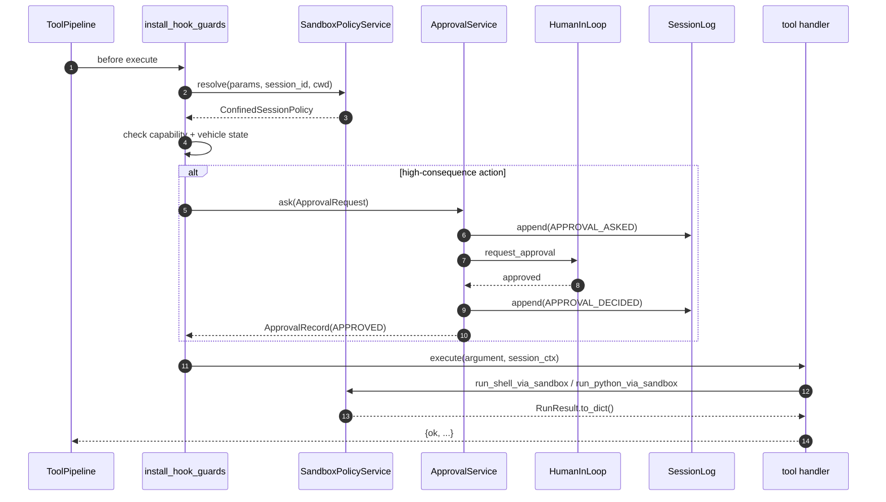
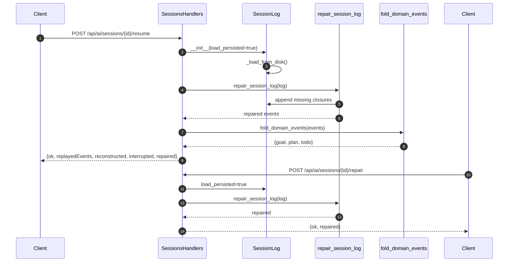
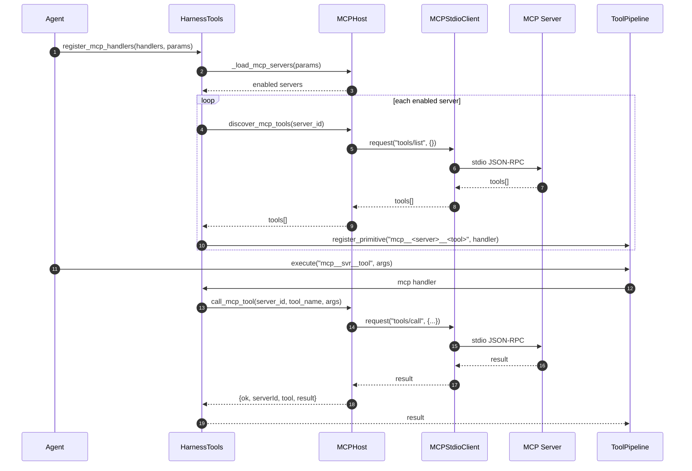
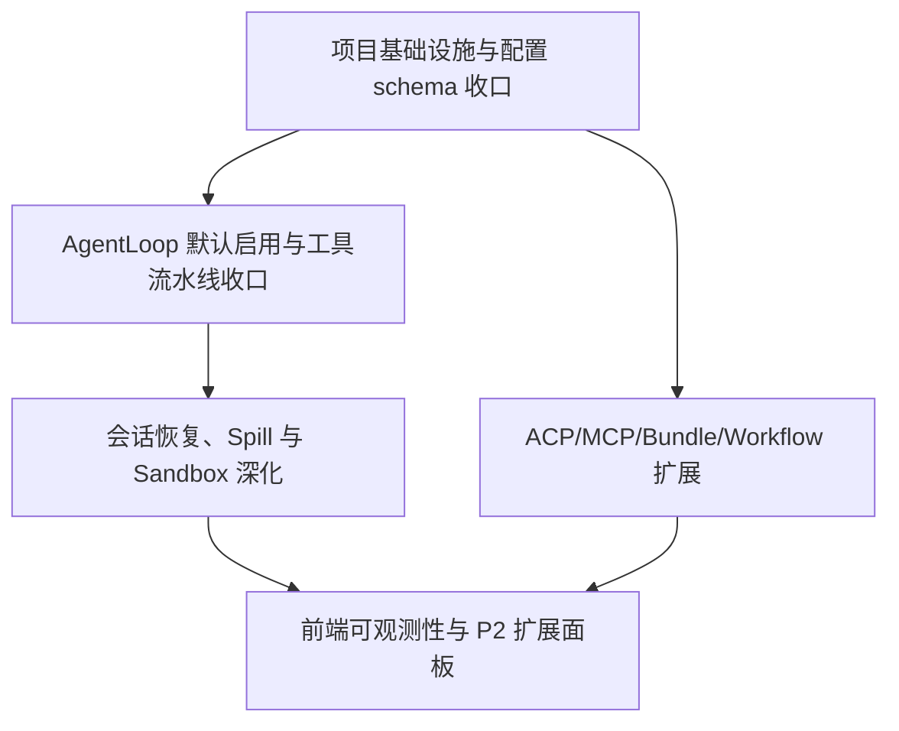

# P1/P2 增量架构设计与任务分解

- **作者**：高见远（software-architect-2-2）
- **版本**：v1.0（2026-09）
- **范围**：在 P0 基础框架已落地的前提下，完成 P1（ACP stdio、bundle/profile、workflow_graph 路由）与 P2（远程 spill、LSP 增强、MCP 资源、workflow 可视化、前端重构）的增量架构设计与任务拆分。
- **基线仓库**：`E:\sp\ai`
- **约束**：不修改 deepseek-harness 上游；不新增车辆控制工具；P1/P2 设计均基于现有 seam 接线扩展。

---

## Part A: System Design

### 1. Implementation Approach

#### 1.1 核心挑战

| 挑战 | 说明 | 设计对策 |
|------|------|----------|
| P0 与 P1 边界模糊 | 大量 P1 模块（`harness_tools.py`、`bundle_handlers.py`、`acp_server.py`、`workflow_graph.py`）已存在，但缺少统一启用开关、配置 schema 与验收回归 | 以"配置 schema + 诊断 + 路由注册"作为 T01 基础设施，先补齐启用面 |
| 工具链双轨并存 | `Agent.run()` 兜底路径与 `AgentLoop` 同时存在；`ToolPipeline` 已有 spill/sandbox/guard hooks，但缺少统一配置面 | 在 `agent.py`/`loop.py` 收口默认走 `run_with_loop`；将 spill/sandbox/guard 统一注册到 `ToolPipeline`，并提供配置 schema |
| 会话可恢复性 | `SessionLog` 已持久化 JSONL，`repair.py` 已提供确定性修复，但 resume/repair 路由与前端状态展示未完全对齐 | 完善 `sessions_handlers.py` 的 resume/repair 语义，并在会话列表展示 interrupted/repair required 状态 |
| MCP/Bunde 动态加载 | MCP 工具 namespace 注册、bundle profile 原子安装已有实现，但缺少健康面板、冲突诊断、远程环境适配 | 新增 bundle profile compose 预览、MCP server health、ACP remote env 适配 seam |
| 前端能力缺口 | Web 仍为 Vanilla JS 多模块，`settings` 已重构但缺少 workflow 可视化、LSP 位置卡片、MCP 资源面板 | P2 以最小侵入方式新增面板模块，不改为完整 SPA |

#### 1.2 技术选型

- **语言/框架**：Python 3.13，复用 dataclass + StrEnum + aiohttp。
- **事件存储**：复用 `SessionLog` JSONL append-only；P2 远程 spill backend 可选 `aiosqlite`/`boto3` 等插件化 backend（本次不强制引入）。
- **配置 schema**：复用 `ai.config.registry` + `ai.config.validator` + `ai.config.schemas/*.json`（G12 已落地）。
- **启动诊断**：复用 `ai.core.diagnostics.run_startup_diagnostics`（G12 已落地）。
- **前端**：原生 JS ES2020 模块，新增 `web/static/js/settings/` 与专用面板模块，无构建链。
- **测试**：pytest/unittest，沿用 `PYTHONPATH=E:\sp\ai` 与 `ai.tests.bootstrap_pc`。

#### 1.3 架构模式

- **配置驱动启用**：所有 P1 增量能力通过 `ai.config.registry` 暴露 schema，默认启用AgentLoop、spill、sandbox；MCP/bundle/workflow 需要显式配置后启用。
- **事件溯源 + 投影**：goal/plan/todo/subagent/session/spill 状态以事件为源，`EventProjectionRegistry` 与 `fold_domain_events` 统一重建。
- **Capability-based 访问控制**：`SandboxPolicyService` + `PermissionPresetService` + `ApprovalService` 三层求交，P1/P2 新增能力均声明对应 `Capability`。
- **插件化 Backend**：spill backend、MCP client、bundle loader、subagent provider 均通过注册表接入，支持本地/远程/数据库多种实现。

---

### 2. File List

```
E:\sp\ai
├── ai
│   ├── config
│   │   ├── registry.py                 # [改] 注册 P1/P2 新增配置命名空间
│   │   ├── validator.py                # [改] 支持 object/list/secret/restart 校验
│   │   └── schemas
│   │       ├── index.json              # [改] 汇总 revision 与文件映射
│   │       ├── conversation.json       # [改] 增加 agentLoop、toolTimeout、streamTimeout
│   │       ├── sandbox.json            # [新] sandbox 模式、shell、containment 参数
│   │       ├── spill.json              # [新] externalizeResults、threshold、backend
│   │       ├── mcp.json                # [新] MCP server 列表、enable、trust 策略
│   │       ├── bundle.json             # [新] bundle/profile 列表、active profile
│   │       ├── workflow.json           # [新] workflow graph 启用、默认 workflow
│   │       ├── lsp.json                # [新] LSP provider 注册、诊断开关
│   │       └── subagent.json           # [新] maxDepth、maxConcurrency、provider 策略
│   ├── core
│   │   ├── diagnostics.py              # [改] 增加 P1/P2 模块 import 检查
│   │   ├── agent
│   │   │   ├── agent.py                # [改] 默认启用 AgentLoop；统一注册 spill/sandbox/guard hooks
│   │   │   └── loop.py                 # [改] workflow_graph 路由、compaction pre-step seam
│   │   ├── chat
│   │   │   └── runner.py               # [改] 附件注入、workflow prompt、记忆组装
│   │   ├── session
│   │   │   ├── log.py                  # [改] resume_ctx、domain event 折叠
│   │   │   ├── repair.py               # [改] 支持损坏尾记录截断、seq 补齐
│   │   │   └── folds.py                # [改] 扩展 goal/plan/todo/subagent/spill fold
│   │   └── tools
│   │       ├── pipeline.py             # [改/扩] 支持 pre/guard/around/post/result 阶段扩展点
│   │       ├── guard.py                # [改] 接入 ApprovalService、VehicleGuard
│   │       └── sandbox_hooks.py        # [改] ShellRunner/PythonRunner 统一接入
│   ├── tools
│   │   ├── harness_tools.py            # [改] goal/plan/todo/subagent/lsp/python/workflow/mcp 工具注册
│   │   ├── agent_tools.py              # [改] make_handlers 调用 harness + mcp 注册
│   │   ├── fs_tools.py                 # [改] run_command/run_shell_command 走 sandbox
│   │   └── result_externalize.py       # [改] 支持 backend 插件接口
│   ├── mcp
│   │   ├── host.py                     # [改] 持久 client、resources/prompts 支持、health 检查
│   │   └── resources.py                # [新] MCP resource 订阅与转换
│   ├── subagent
│   │   ├── runner.py                   # [改] capability 校验、lineage 事件
│   │   ├── pool.py                     # [改] 并发控制、cost quota、lineage
│   │   ├── lineage.py                  # [改] 从事件重建 delegation 树
│   │   ├── capabilities.py             # [改] provider matrix 扩展
│   │   └── providers.py                # [改] 新增 ACP/Codex/fork provider
│   ├── bundle
│   │   ├── manifest.py                 # [改] patch_operations、profile_bundles、capabilities
│   │   ├── loader.py                   # [改] 原子安装、ACP package 展开
│   │   ├── profile_compose.py          # [改] 冲突诊断、compose 预览
│   │   └── store.py                    # [改] profile 持久化、active profile
│   ├── acp
│   │   ├── protocol.py                 # [改] JSON-RPC 帧协议、远程 env 适配
│   │   └── loader.py                   # [改] AcpToolProvider/AcpMcpProvider 注入
│   ├── lsp
│   │   ├── server_manager.py           # [改] provider 注册、生命周期、取消升级
│   │   ├── client.py                   # [改] definition/references/implementation/hover
│   │   └── diagnostics.py              # [新] 诊断聚合、pull/publish 模型
│   ├── cli
│   │   └── acp_server.py               # [改] stdio server、initialize/prompt/cancel/shutdown、--smoke
│   ├── tools/domains/platform
│   │   └── workflow_graph.py           # [改] graph 执行、条件/重试/暂停/恢复、requires_tools 预检
│   ├── server
│   │   ├── app_factory.py              # [改] 启动任务、LSP/Spill manager 初始化
│   │   ├── routes/__init__.py          # [改] 注册 resume/repair/bundle/profile/workflow 路由
│   │   └── handlers
│   │       ├── chat_handlers.py        # [改] harness_tool_schemas 并入 tools 列表
│   │       ├── sessions_handlers.py    # [改] resume/repair 路由、domain state 重建
│   │       ├── bundle_handlers.py      # [改] bundle 安装/profile 切换/compose 预览
│   │       ├── lsp_handlers.py         # [改] LSP 服务器管理、查询
│   │       ├── mcp_handlers.py         # [新] MCP server health、resources、prompts
│   │       └── workflow_handlers.py    # [新] workflow graph CRUD + 运行控制
│   ├── web/static
│   │   ├── index.html                  # [改] 6 域 Tab + 搜索 + 设置容器
│   │   ├── js
│   │   │   ├── ai.js                   # [改] 设置抽屉接入 settings 模块
│   │   │   ├── sessions.js             # [改] 会话列表显示 interrupted/repair/workflow
│   │   │   ├── web-api.js              # [改] configApi、mcpApi、workflowApi
│   │   │   ├── settings                # [改/新] registry/render/save/dangerous/search/index
│   │   │   ├── workflow-editor.js      # [改] graph 可视化编辑
│   │   │   ├── harness-panel.js        # [改] goal/plan/todo/subagent 状态面板
│   │   │   └── mcp-panel.js            # [新] MCP server health、resources 面板
│   │   └── css
│   │       └── settings-modules.css    # [改] 卡片/搜索/危险操作样式
│   └── docs
│       ├── system_design_p1p2.md       # 本文件
│       ├── class-diagram_p1p2.mermaid  # 类图（从本文件提取）
│       └── sequence-diagram_p1p2.mermaid # 时序图（从本文件提取）
└── tests
    └── test_harness_enable.py          # [改] P0-1~P0-8 + P1/P2 主路径回归
```

---

### 3. Data Structures and Interfaces

```mermaid
classDiagram
    direction TB

    class EventType {
        <<enumeration>>
        TURN_START
        TURN_END
        STEP_START
        STEP_END
        USER_MESSAGE
        ASSISTANT_MESSAGE
        TOOL_CALL
        TOOL_RESULT
        REQUEST_HEADER
        REQUEST_CONTEXT
        LIFECYCLE
        GOAL_CHANGE
        PLAN_CHANGE
        TODO_CHANGE
        SCHEDULE_CHANGE
        SUBAGENT_START
        SUBAGENT_END
        COMPACTION_PRUNE
        COMMAND_RUN
        COMMAND_DONE
        MCP_TRUST_ASKED
        MCP_TRUST_DECIDED
        SPILL_EXTERNALIZED
        SPILL_RECALL
    }

    class SessionEvent {
        +EventType type
        +int seq
        +int time
        +Any data
        +SurfaceOp|None surface_op
        +tuple[int]|None source_seqs
        +to_dict() dict
    }

    class SessionLog {
        +str session_id
        +tuple~SessionEvent~ events
        +Path|None persist_path
        +append(type, data, surface_op) SessionEvent
        +append_domain_event(domain, snapshot, tombstone) SessionEvent
        +derive_messages() list[dict]
        +request_header() RequestHeader|None
        +resume_ctx() ResumeContext
    }

    class ResumeContext {
        +dict goal
        +dict plan
        +dict todo
        +list[str] interrupted
        +list[SessionEvent] repaired
    }

    class RepairResult {
        +list[SessionEvent] repaired
        +list[str] interrupted
        +str|None original_copy_path
        +to_dict() dict
    }

    class AgentLoop {
        +str session_id
        +str agent_id
        +Any params
        +ToolPipeline tool_pipeline
        +SessionLog log
        +int max_tool_rounds
        +float tool_timeout
        +float stream_timeout
        +str|None workflow_id
        +Any compaction
        +run_until_idle(is_cancelled) dict
        +_turn() bool
        +_step(turn, step) str
        +configure_request(provider, model, system, tools)
    }

    class ToolPipeline {
        +dict[str, Callable] _tools
        +add_pre_hook(hook)
        +add_guard_hook(hook)
        +add_around_hook(hook)
        +add_post_hook(hook)
        +add_post_waterfall(hook)
        +register_primitive(name, handler)
        +execute(call_id, name, raw_arguments, ...) dict
    }

    class ToolResult {
        +bool ok
        +Any value
        +str|None content
        +dict|None block
        +dict|None meta
    }

    class SpillBackend {
        <<interface>>
        +write(text, session_id, tool_name, call_id) SpillRef
        +read(ref) str
        +delete(ref) bool
    }

    class LocalSpillBackend {
        +Path base_dir
        +write(...) SpillRef
        +read(ref) str
    }

    class RemoteSpillBackend {
        +str endpoint
        +write(...) SpillRef
        +read(ref) str
    }

    class SandboxPolicyService {
        +ConfinedSandboxMode DEFAULT_MODE
        +resolve(params, session_id, cwd) ConfinedSessionPolicy
        +contained_cwd(requested) str
    }

    class ConfinedSessionPolicy {
        +str session_id
        +ConfinedSandboxMode mode
        +str containment_root
        +to_context() dict
        +to_dict() dict
    }

    class ShellRunner {
        +str workspace_root
        +run_shell(command, timeout, policy, cwd) RunResult
    }

    class PythonRunner {
        +str workspace_root
        +run_python(code, timeout, bindings, cwd) RunResult
    }

    class ApprovalService {
        +HumanInLoop hitl
        +EventProjectionRegistry registry
        +ask(record, session_log, request) ApprovalRecord
        +decide(approval_id, approved, decided_by) ApprovalRecord
        +is_allowed(approval_id) bool
        +fold_approvals(events) dict[str, ApprovalRecord]
    }

    class ApprovalRecord {
        +str approval_id
        +ApprovalRequest request
        +ApprovalState state
        +int asked_at
        +int|None decided_at
        +str|None decided_by
        +to_dict() dict
    }

    class ConfigRegistry {
        +register_schema(namespace, fields, revision)
        +get_schema(namespace) dict
        +all() dict
        +namespaces() list[str]
    }

    class SchemaField {
        +str key
        +str type
        +Any default
        +float|None min
        +float|None max
        +list|None enum
        +bool secret
        +bool restart
        +str label
        +str description
    }

    class ConfigValidator {
        +validate_payload(schema, payload) list[ValidationError]
    }

    class BundleManifest {
        +str id
        +str name
        +str version
        +list~BundlePackageRef~ packages
        +patch_operations() list[dict]
        +profile_bundles() list[str]
        +capabilities() set[str]
        +to_dict() dict
    }

    class ProfileComposer {
        +Any bundle_loader
        +Any profile_manager
        +compose(profile_id, bundles) tuple[dict, list[str]]
        +preview(profile_id, bundles) list[PatchLayer]
        +has_conflicts(profile_id, bundles) bool
    }

    class PatchLayer {
        +int order
        +str source
        +list[dict] operations
        +to_dict() dict
    }

    class MCPStdioClient {
        +str command
        +list[str] args
        +dict[str, str] env
        +async start()
        +async request(method, params) Any
        +async close()
    }

    class MCPHost {
        +Params params
        +discover_tools(server_id) dict
        +call_tool(server_id, tool_name, args, session_id) dict
        +list_resources(server_id) list[dict]
        +read_resource(server_id, uri) dict
        +list_prompts(server_id) list[dict]
        +health_check(server_id) dict
    }

    class AcpStdioServer {
        +Any params
        +str session_id
        +async handle(msg) list[dict]
        +async run()
        +_run_prompt(content) dict
    }

    class GraphExecutor {
        +register(kind, handler)
        +async run(graph, inputs) GraphResult
    }

    class Graph {
        +dict nodes
        +dict edges
        +start_nodes() list[Node]
        +outgoing(node_id) list[Edge]
    }

    class SubagentPool {
        +int max_concurrency
        +SubagentLineage lineage
        +create_task(...) SubagentTask
        +submit(task, ...) asyncio.Task
        +run(task, ...) SubagentResult
        +run_many(tasks, ...) list[SubagentResult]
    }

    class SubagentTask {
        +str id
        +str agent_id
        +str prompt
        +str provider
        +int depth
        +int max_depth
        +dict|None output_schema
        +list[str]|None tools
        +str parent_id
        +str origin
        +to_dict() dict
    }

    class SubagentLineage {
        +add_edge(parent_task, child_task, run_id, depth, origin)
        +children(parent_task) list[dict]
        +roots() list[str]
        +rebuild_from_events(events)
    }

    class LspServerManager {
        +get_client(workspace_root) LspClient|None
        +register_provider(ext, factory)
        +async stop_all()
    }

    class LspClient {
        +async definition(uri, line, char) list
        +async references(uri, line, char) list
        +async implementation(uri, line, char) list
        +async hover(uri, line, char) dict|None
        +async diagnostics(uri) list
        +async rename(uri, line, char, newName) dict
    }

    SessionLog --> SessionEvent : appends
    SessionLog --> ResumeContext : resume_ctx
    AgentLoop --> SessionLog : owns
    AgentLoop --> ToolPipeline : owns
    ToolPipeline --> ToolResult : produces
    ToolPipeline --> SpillBackend : post-execute spill
    LocalSpillBackend --|> SpillBackend
    RemoteSpillBackend --|> SpillBackend
    SandboxPolicyService --> ConfinedSessionPolicy : produces
    ShellRunner --> ConfinedSessionPolicy : uses
    PythonRunner --> ConfinedSessionPolicy : uses
    ApprovalService --> ApprovalRecord : produces
    ApprovalService --> HumanInLoop : delegates
    ConfigRegistry --> SchemaField : manages
    ConfigValidator --> ConfigRegistry : consumes
    ProfileComposer --> PatchLayer : produces
    ProfileComposer --> BundleManifest : consumes
    MCPHost --> MCPStdioClient : manages
    AcpStdioServer --> MCPHost : may use
    AcpStdioServer --> AgentLoop : drives
    GraphExecutor --> Graph : executes
    SubagentPool --> SubagentTask : manages
    SubagentPool --> SubagentLineage : tracks
    SubagentLineage --> SessionEvent : rebuilds from
    LspServerManager --> LspClient : manages
```



---

### 4. Program Call Flow

#### 4.1 新会话默认走 AgentLoop + 工具流水线

```mermaid
sequenceDiagram
    autonumber
    participant Client
    participant chat_handlers as ChatHandlers
    participant Agent as Agent facade
    participant Loop as AgentLoop
    participant Pipeline as ToolPipeline
    participant LLM as chat_completion_with_failover
    participant Spill as spill post-hook
    participant Sandbox as sandbox_hooks

    Client->>chat_handlers: POST /api/ai/chat {messages, tools=true}
    chat_handlers->>chat_handlers: _prepare_chat_run()
    chat_handlers->>Agent: run_chat_with_agents(body, tools, ...)
    Agent->>Agent: __init__(ai_use_agent_loop=true)
    Agent->>Pipeline: ToolPipeline(handlers)
    Agent->>Pipeline: add_post_waterfall(spill)
    Agent->>Pipeline: install_hook_guards(sandbox/approval)
    Agent->>Agent: _build_messages()
    Agent->>Loop: AgentLoop(...)
    Agent->>Loop: run_until_idle()
    Loop->>Loop: _turn()
    Loop->>Loop: _step(turn, step)
    Loop->>LLM: stream_fn(request)
    LLM-->>Loop: assistant_msg + tool_calls
    Loop->>Pipeline: execute(call_id, name, args)
    Pipeline->>Sandbox: guard check / sandbox run
    Pipeline->>Spill: externalize oversized result
    Pipeline-->>Loop: ToolResult
    Loop->>Loop: log.append(TOOL_RESULT)
    Loop-->>Agent: {ok, agentId}
    Agent-->>chat_handlers: done event
    chat_handlers-->>Client: SSE stream ends
```

#### 4.2 工具调用触发审批 + Sandbox 执行



#### 4.3 Session Resume / Repair



#### 4.4 Bundle / Profile 安装与合成

```mermaid
sequenceDiagram
    autonumber
    participant Client
    participant bundle_handlers as BundleHandlers
    participant BundleStore as BundleStore
    participant BundleLoader as BundleLoader
   ACP as AcpLoader
    participant ProfileComposer as ProfileComposer
    participant routes as Routes

    Client->>bundle_handlers: POST /api/ai/bundle {bundleId}
    bundle_handlers->>BundleStore: install_bundle(bundleId, target, clean=true)
    BundleStore->>BundleLoader: install(bundle_path, target)
    BundleLoader->>ACP: load_directory / load_file
    ACP-->>BundleLoader: AcpPackage
    BundleLoader-->>BundleStore: manifest
    bundle_handlers->>ProfileComposer: preview(profile_id, bundles)
    ProfileComposer->>BundleLoader: resolve_bundle
    BundleLoader-->>ProfileComposer: BundleManifest
    ProfileComposer-->>bundle_handlers: PatchLayer[]
    bundle_handlers->>ProfileComposer: compose(profile_id, bundles)
    ProfileComposer-->>bundle_handlers: {merged_config, conflicts}
    bundle_handlers->>routes: apply merged_config to params/session metadata
    bundle_handlers-->>Client: {ok, bundle, profile, conflicts}
```

#### 4.5 MCP 工具发现与调用



---

### 5. Anything UNCLEAR

1. **P1 ACP stdio 是否纳入默认安装包**：`python -m ai.cli.acp_server` 已可独立运行，但车辆 OTA 包是否需要默认安装脚本尚不明确；建议作为可选 CLI 工具打包。
2. **P2 远程 spill backend 实现优先级**：PRD 列为 P2，但实现涉及网络/鉴权/配额，建议先定义 `SpillBackend` 接口并保留本地默认实现，远程 backend 作为后续插件。
3. **LSP diagnostics/rename 权限模型**：P2 要求独立写入预览，需要确认是否引入 "workspace-write" capability 的 HITL 审批，还是仅允许只读操作。
4. **bundle profile 生效时机**：当前 `bundle_handlers.api_bundle` 安装后立即生效；是否需要支持 "仅对新会话生效" 的开关待产品确认。
5. **workflow graph 可视化编辑器技术栈**：前端 Vanilla JS 已能渲染简单 graph，复杂可视化（D3/mermaid.js）是否引入外部库待确认。

---

## Part B: Task Decomposition

### 6. Required Packages

本增量以 Python 标准库 + 现有依赖为主，可选引入：

- `aiohttp>=3.9`：已有，HTTP server。
- `openpilot-common`：已有，Params / cloudlog。
- `pytest` / `unittest`：已有，测试。
- `croniter`（可选）：若 G6 agent scheduler 需要完整 cron 语义；当前 `tools/domains/agent_scheduler.py` 可手写解析避免新依赖。
- `aiosqlite`（P2 可选）：远程 spill backend 或 MCP resources 持久化缓存。
- `mcp` SDK（P2 可选）：若需完整 MCP client 协议支持；当前 `mcp/host.py` 为轻量 stdio JSON-RPC 实现。

> 默认不引入新包；P2 可选包通过条件导入与 graceful degrade 处理。

---

### 7. Task List (ordered by dependency)

| Task ID | Task Name | Source Files | Dependencies | Priority |
|---------|-----------|--------------|--------------|----------|
| **T01** | **项目基础设施与配置 schema 收口** | `ai/config/registry.py`、`ai/config/validator.py`、`ai/config/schemas/*.json`（新增/修改）、`ai/core/diagnostics.py`、`ai/aid.py`、`ai/server/routes/__init__.py` | — | P0 |
| **T02** | **AgentLoop 默认启用与工具流水线收口** | `ai/core/agent/agent.py`、`ai/core/agent/loop.py`、`ai/tools/harness_tools.py`、`ai/tools/agent_tools.py`、`ai/server/handlers/chat_handlers.py` | T01 | P0 |
| **T03** | **会话恢复、Spill 与 Sandbox 深化** | `ai/core/session/log.py`、`ai/core/session/repair.py`、`ai/core/session/folds.py`、`ai/tools/result_externalize.py`、`ai/core/tools/sandbox_hooks.py`、`ai/tools/fs_tools.py`、`ai/server/handlers/sessions_handlers.py` | T02 | P0 |
| **T04** | **ACP/MCP/Bundle/Workflow 扩展** | `ai/cli/acp_server.py`、`ai/mcp/host.py`、`ai/mcp/resources.py`、`ai/bundle/manifest.py`、`ai/bundle/loader.py`、`ai/bundle/profile_compose.py`、`ai/bundle/store.py`、`ai/tools/domains/platform/workflow_graph.py`、`ai/server/handlers/bundle_handlers.py`、`ai/server/handlers/workflow_handlers.py`、`ai/server/handlers/mcp_handlers.py`、`ai/acp/protocol.py`、`ai/acp/loader.py` | T01, T02 | P1 |
| **T05** | **前端可观测性与 P2 扩展面板** | `ai/web/static/index.html`、`ai/web/static/js/ai.js`、`ai/web/static/js/sessions.js`、`ai/web/static/js/web-api.js`、`ai/web/static/js/settings/*.js`、`ai/web/static/js/workflow-editor.js`、`ai/web/static/js/harness-panel.js`、`ai/web/static/js/mcp-panel.js`、`ai/web/static/css/settings-modules.css`、`ai/lsp/diagnostics.py`、`ai/lsp/server_manager.py` | T03, T04 | P2 |

#### 任务验收标准

**T01 验收**：
- `ConfigRegistry` 能加载并返回 `sandbox/spill/mcp/bundle/workflow/lsp/subagent` 等新增命名空间 schema。
- `validate_payload` 对 `secret/restart/enum/min/max` 字段返回稳定错误码。
- `aid.py` 启动时调用 `run_startup_diagnostics` 并通过新增 P1/P2 模块 import 检查；致命错误不阻塞启动但记录 cloudlog。
- `/api/ai/config/schema?namespace=...` 返回正确 schema；`/api/ai/config/diagnose` 返回诊断结果。

**T02 验收**：
- 新会话无显式 `useAgentLoop` 参数时默认进入 `run_with_loop()`；旧 `run()` 路径保留但不再默认进入。
- `harness_tool_schemas()` 返回的 goal/plan/todo/subagent/lsp/python/workflow/mcp 工具被合并到 LLM tools 列表。
- `ToolPipeline` 在 `Agent.__init__` 中统一安装 spill post-waterfall 与 guard hooks。
- 单元测试：`test_agent_facade.py` 通过；新会话至少触发一次模型工具调用事件。

**T03 验收**：
- `SessionLog.load_persisted=true` 可加载损坏日志；`repair_session_log` 生成确定性 closure 事件且不臆造模型结果。
- `/api/ai/sessions/{id}/resume` 返回 `{replayedEvents, reconstructed:{goal,plan,todo}, interrupted, repaired}`。
- spill post-execute 对非 read/grep 工具的大结果生成 `toolresult://` 指针；小结果、非文本、read 结果不变。
- shell/python 工具通过 `sandbox_hooks.py` 执行；越权路径、超时、取消返回结构化错误并含 sandbox policy 摘要。

**T04 验收**：
- `python -m ai.cli.acp_server --smoke` 通过（initialize/tools/list/session/create/shutdown）。
- 已授权 MCP server 的工具以 `mcp__<server>__<tool>` 形式被 LLM 发现并调用；未授权 server 不可见。
- `POST /api/ai/bundle` 原子安装 bundle，失败回滚；`GET /api/ai/profile/current` 返回生效 profile；`ProfileComposer.compose` 返回冲突诊断。
- workflow graph 可按 `advance_graph_workflow` 步进，节点不满足 `requires_tools` 时提前失败并返回替代路径。

**T05 验收**：
- Web 设置页新增 AgentLoop、profile/bundle、MCP server、sandbox、LSP provider 配置卡片，高风险权限显式确认。
- 会话列表显示 interrupted、repair required、最后 workflow 节点、附件与 spill 数量；提供 Resume/Repair 入口。
- 工具结果 UI 显示 spill 提示、来源 server、LSP 位置卡片；不泄露完整环境变量或宿主路径。
- （P2）workflow editor 可增删节点/边并保存 graph；MCP panel 显示 server health 与 resources；LSP panel 显示 diagnostics/rename 预览。

---

### 8. Shared Knowledge

- **错误返回**：工具与 API 统一返回 `{ok, error?, error_code?}`；稳定错误码见 `ai/core/errors.py`（`ERR_CONFIG_INVALID`、`ERR_NOT_FOUND`、`ERR_PROFILE_CONFLICT`、`ERR_STARTUP_DIAG` 等）。
- **事件协议**：SSE 事件类型包括 `tool_call`、`tool_result`、`tool_call_delta`、`content`、`reasoning`、`trace`、`error`、`done`、`canvas`、`usage`、`prompt_budget`、`agent_status`、`agent_done`、`session/repaired`。
- **代码风格**：2 空格缩进、行宽 160、绝对 import rooted at `ai.`；测试文件命名 `test_*.py`。
- **开关参数（Params）**：
  - `ai_use_agent_loop`：默认 true
  - `ai_sandbox_shell`：默认 true
  - `ai_sandbox_mode`：默认 `read-only`
  - `ai_externalize_results`：默认 true
  - `ai_externalize_threshold`：默认 8192
  - `ai_mcp_servers`：JSON 数组，默认 `[]`
  - `ai_active_profile` / `ai_active_bundles`：P1 profile 选择
- **命名空间**：MCP 工具 `mcp_<server>_<tool>`；spill ref `toolresult://<id>`；subagent task `sub-<uuid>`；ACP session `acp-<hex>`。
- **Capability 映射**：新增 `MCP_TOOL_ACCESS`、`BUNDLE_INSTALL`、`WORKFLOW_GRAPH_WRITE`、`LSP_RENAME`、`REMOTE_SPILL_WRITE` 等 capability，需在 `ai/permissions/capability.py` 追加并在 PermissionPreset builtin 中声明默认 `GrantState`。
- **安全硬限制**：即使 capability 为 ALLOWED，行车状态（`enabled=True` 或 `v_ego_m_s > threshold`）下仍拒绝 `vehicle_flash`、`can_bus_access`、直接控车相关操作。
- **本地 dev 运行**：`cd /e/sp && PYTHONPATH="E:\sp\ai" python -m pytest ai/tests/test_harness_enable.py ai/tests/test_agent_facade.py ai/tests/test_subagent_capabilities.py -q`

---

### 9. Task Dependency Graph


