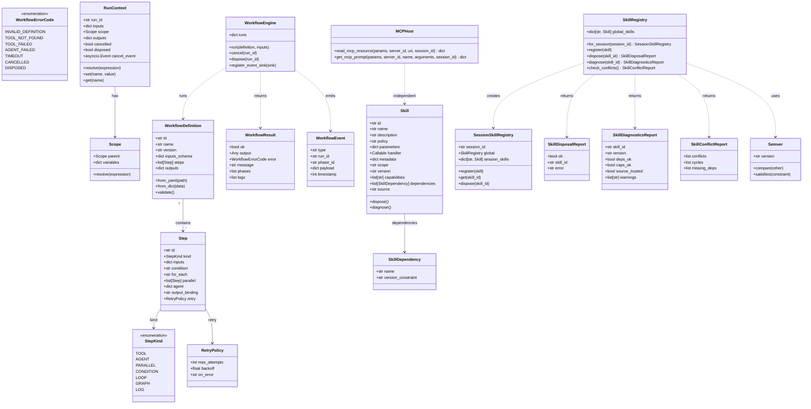
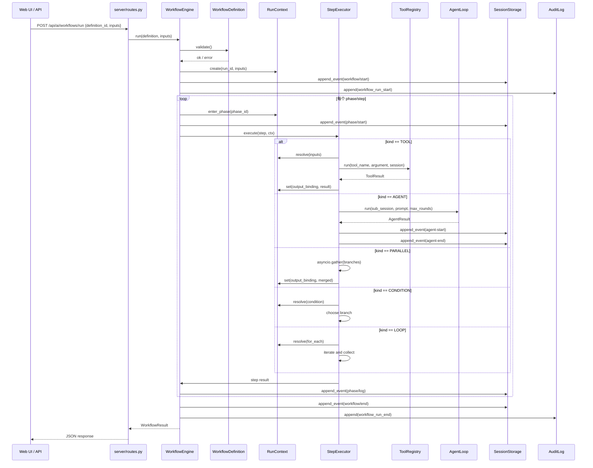
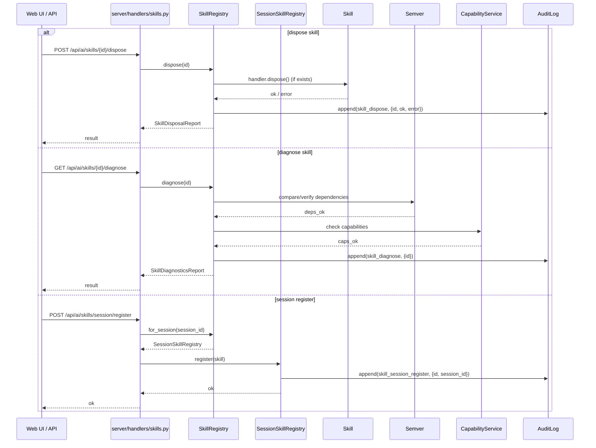
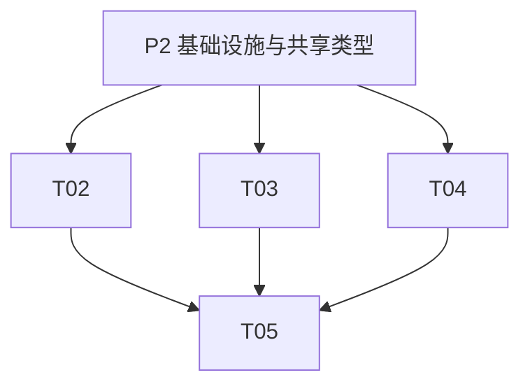

# AI OP 助手 P2 增量架构设计

> **对应 PRD**: `E:\sp\ai\docs\PRD-P2-incremental.md`  
> **版本**: v1.0  
> **日期**: 2026-09-12  
> **编写**: software-architect

---

## Part A: System Design

### 1. Implementation Approach

#### 1.1 核心技术分析

P2 增量聚焦三项能力，均不阻塞 P0/P1 主线，但需要在主线完成后以独立模块落地：

1. **WorkflowEngine 脚本运行时语义**：当前已有 `ai/core/graph/executor.py` 的图遍历和 `ai/tools/domains/platform/workflow_*.py` 的 prompt/JSON 图工作流，但缺少脚本级变量作用域、phase/log 事件、条件/循环/并发、子代理调用和结构化错误码。新增 `ai/core/workflow/` 作为独立运行时，与现有图执行并存。
2. **Skill scope/version/disposal 生命周期**：当前 Skill 是全局单例、无版本语义、无 dispose hook。需要扩展 `Skill` 模型，引入 session 级 overlay registry、semver 比较、依赖诊断、冲突检测和 dispose 生命周期。
3. **MCP resources/read 与 prompts/get**：当前已实现 `discover_*`，缺少 `read_mcp_resource` 和 `get_mcp_prompt`。复用现有 `MCPStdioClient.request` 和 session 锁即可补齐，无需引入新 transport。

#### 1.2 框架与库选型

| 层级 | 选型 | 说明 |
|------|------|------|
| Workflow DSL | YAML/JSON 声明式 | 便于后续前端可视化，与现有 JSON 图工作流对齐 |
| 变量表达式 | Jinja-lite / `${}` 语法 | 简单、可控，不引入完整 Jinja2 依赖 |
| Semver | 内部实现 `ai/skill/semver.py` | 零新依赖，覆盖标准 semver 比较 |
| 并发 | asyncio.gather + timeout | 并行分支由 grace timer 统一控制 |
| MCP | 复用 `MCPStdioClient` | 不新增 transport，保持 stdio |
| 测试 | pytest + pytest-asyncio | 异步测试覆盖 workflow 与 mcp |

#### 1.3 架构模式

- **独立模块扩展**：`ai/core/workflow/`、`ai/skill/` 扩展、`ai/mcp/host.py` 增量接口，均通过开关/独立函数引入，不影响 P0/P1 主路径。
- **事件溯源**：WorkflowEngine 运行期间写入 session event；Skill dispose、MCP resource/prompt 调用写入 audit event。
- **Fail-loud**：Skill 版本冲突、缺失依赖、Workflow 非法定义均返回结构化错误码，不静默忽略。

---

### 2. File List

```
ai/
├── core/
│   ├── workflow/
│   │   ├── __init__.py              # 导出 WorkflowEngine 等公共 API
│   │   ├── errors.py                # WorkflowErrorCode
│   │   ├── events.py                # workflow/start, phase/*, agent-start/end, workflow/end
│   │   ├── context.py               # RunContext, Scope, 变量引用解析
│   │   ├── definition.py            # WorkflowDefinition, Step, 解析与校验
│   │   ├── engine.py                # WorkflowEngine 主入口
│   │   └── tests/
│   │       └── test_engine.py       # WorkflowEngine 单元测试
│   └── agent/
│       └── loop.py                  # AgentLoop workflow_id 集成（轻量改动）
├── skill/
│   ├── models.py                    # Skill 字段扩展（scope/version/dependencies/capabilities/source）
│   ├── semver.py                    # 内部 semver 比较
│   ├── session_registry.py          # SessionSkillRegistry overlay 视图
│   ├── registry.py                  # SkillRegistry 扩展：for_session/dispose/diagnose/check_conflicts
│   ├── builtins.py                  # 内置 skill 升级示例
│   ├── diagnostics.py               # SkillDiagnosisReport 生成
│   ├── conflicts.py                 # SkillConflictReport 生成
│   └── tests/
│       └── test_lifecycle.py        # Skill 生命周期测试
├── mcp/
│   ├── host.py                      # 新增 read_mcp_resource / get_mcp_prompt
│   └── tests/
│       └── test_resources_prompts.py # MCP resources/prompts 测试
├── server/
│   ├── handlers/
│   │   ├── phase2.py                # MCP HTTP operation 扩展
│   │   ├── skills.py                # Skill HTTP 路由（新增）
│   │   └── tests/
│   │       └── test_phase2_mcp.py   # phase2 handler 测试
│   └── routes.py                    # 注册 skill HTTP 路由（轻量改动）
├── tools/
│   └── domains/
│       └── platform/
│           └── platform_extensions.py # 注册 read_mcp_resource / get_mcp_prompt 工具
├── tests/
│   └── test_p2_integration.py       # P2 端到端集成测试
└── docs/
    ├── CAPABILITIES.md              # 更新能力清单
    └── PLUGIN_DEV.md                # 更新插件开发文档
```

---

### 3. Data Structures and Interfaces



---

### 4. Program Call Flow

#### 4.1 WorkflowEngine 运行一次 workflow



#### 4.2 Skill 生命周期：dispose / diagnose / conflicts



#### 4.3 MCP resources/read 与 prompts/get

```mermaid
sequenceDiagram
    participant User as Web UI / API
    participant Ext as platform_extensions.py
    participant Host as MCPHost
    parameter Client as MCPStdioClient
    participant Server as MCP Server (stdio)
    participant Audit as AuditLog

    alt read_mcp_resource
        User->>Ext: tool call read_mcp_resource
        Ext->>Host: read_mcp_resource(params, server_id, uri, session_id)
        Host->>Client: request("resources/read", {uri})
        Client->>Server: JSON-RPC resources/read
        Server-->>Client: contents
        Client-->>Host: contents
        Host->>Audit: append(mcp_resource_read, {server_id, uri})
        Host-->>Ext: {ok, serverId, uri, contents}
        Ext-->>User: tool result
    else get_mcp_prompt
        User->>Ext: tool call get_mcp_prompt
        Ext->>Host: get_mcp_prompt(params, server_id, name, arguments, session_id)
        Host->>Client: request("prompts/get", {name, arguments})
        Client->>Server: JSON-RPC prompts/get
        Server-->>Client: messages
        Client-->>Host: messages
        Host->>Audit: append(mcp_prompt_get, {server_id, name})
        Host-->>Ext: {ok, serverId, name, messages}
        Ext-->>User: tool result
    end
```

---

### 5. Anything UNCLEAR

基于 PRD 第 7 节待确认问题，本设计给出建议答案：

1. **WorkflowEngine DSL 选择**：建议 YAML/JSON 声明式，与现有 `workflow_graph.py` 的 JSON 图天然对齐，也便于未来前端可视化。
2. **Skill session scope 生命周期**：建议随 AgentLoop session 关闭 dispose，由 `SessionManager` 在会话 close 时调用 `SessionSkillRegistry.dispose_all()`。
3. **MCP resource/prompt 工具命名**：建议与现有 `call_mcp_tool`/`discover_mcp_tools` 保持一致，使用 `read_mcp_resource` 和 `get_mcp_prompt`。
4. **WorkflowEngine 与现有图工作流的关系**：建议允许 workflow definition 中嵌入 `kind: graph` 步骤调用现有 `GraphExecutor`，作为 migration 路径。
5. **Skill dispose 失败策略**：建议记录错误但仍移除 skill，避免死锁；`SkillDisposalReport.error` 非空表示 dispose hook 异常。

额外假设：
- WorkflowEngine 默认关闭，仅当请求显式携带 `workflow_id` 或 `definition` 时启用，不影响 P0/P1 chat 主路径。
- Skill 版本冲突检测默认只报警不阻止注册，除非调用 `check_conflicts()` 显式失败。
- MCP resource/prompt 调用同样受 capability 与 sandbox policy 约束，通过 `params` 透传 session 上下文。

---

## Part B: Task Decomposition

### 6. Required Packages

P2 增量以零新核心依赖为目标，全部使用现有依赖或内部实现：

```
# 已存在
- python>=3.13
- pyyaml>=6.0          # workflow YAML 解析
- pydantic>=2.5        # Skill/WorkflowDefinition 校验
- pytest>=8.0.0
- pytest-asyncio       # 异步测试

# 可选（若团队决定使用成熟 semver 库而非内部实现）
- packaging>=23.0      # 替代内部 semver.py，但建议零依赖自实现
```

P2 不新增：Jinja2、MCP SDK、workflow 可视化库。

---

### 7. Task List

| Task ID | Task Name | Source Files | Dependencies | Priority |
|---------|-----------|--------------|--------------|----------|
| T01 | **P2 基础设施与共享类型** | `ai/core/workflow/__init__.py`, `ai/core/workflow/errors.py`, `ai/core/workflow/events.py`, `ai/skill/semver.py`, `ai/skill/session_registry.py`, `ai/mcp/tests/test_resources_prompts.py` | - | P2 |
| T02 | **MCP resources/read 与 prompts/get** | `ai/mcp/host.py`, `ai/server/handlers/phase2.py`, `ai/tools/domains/platform/platform_extensions.py`, `ai/mcp/tests/test_resources_prompts.py` | T01 | P2 |
| T03 | **Skill scope/version/disposal 生命周期** | `ai/skill/models.py`, `ai/skill/registry.py`, `ai/skill/session_registry.py`, `ai/skill/diagnostics.py`, `ai/skill/conflicts.py`, `ai/skill/builtins.py`, `ai/server/handlers/skills.py`, `ai/skill/tests/test_lifecycle.py` | T01 | P2 |
| T04 | **WorkflowEngine 核心引擎** | `ai/core/workflow/definition.py`, `ai/core/workflow/context.py`, `ai/core/workflow/engine.py`, `ai/core/workflow/tests/test_engine.py` | T01 | P2 |
| T05 | **AgentLoop 集成、HTTP 路由、文档与回归测试** | `ai/core/agent/loop.py`, `ai/server/routes.py`, `ai/server/handlers/skills.py`, `ai/tests/test_p2_integration.py`, `docs/CAPABILITIES.md`, `docs/PLUGIN_DEV.md` | T02, T03, T04 | P2 |

---

### 8. Shared Knowledge

- **Workflow event 类型**：必须写入 session event log 的类型包括 `workflow/start`、`phase/start`、`phase/log`、`agent-start`、`agent-end`、`workflow/end`。
- **Audit event 命名**：
  - `workflow_run_start` / `workflow_run_end`
  - `skill_dispose` / `skill_diagnose` / `skill_session_register`
  - `mcp_resource_read` / `mcp_prompt_get`
- **错误码前缀**：
  - `WF_` 表示 Workflow 错误（如 `WF_INVALID_DEFINITION`）
  - `SK_` 表示 Skill 错误（如 `SK_VERSION_CONFLICT`）
  - `MCP_` 表示 MCP 错误（如 `MCP_RESOURCE_NOT_FOUND`）
- **变量插值语法**：`${steps.step_id.output.field}`，支持 `inputs.x`、`steps.x.output`、`globals.y`。
- **Semver 规则**：`1.2.0 < 1.10.0 < 2.0.0-alpha`，约束符支持 `>=1.2.0`、`^1.0.0`。
- **MCP namespace**：工具命名保持 `call_mcp_tool` 风格；resource/prompt 工具名为 `read_mcp_resource` 和 `get_mcp_prompt`。
- **Session Skill 清理**：`SessionManager.close_session(session_id)` 必须调用 `SkillRegistry.for_session(session_id).dispose_all()`。
- **Fail-loud 策略**：Skill 版本冲突、循环依赖、缺失依赖不静默通过；Workflow 非法定义在 `WorkflowDefinition.validate()` 阶段即失败。

---

### 9. Task Dependency Graph



---

*本文档为 P2 增量架构设计输出，后续由 software-engineer 按 Task List 实施。*
