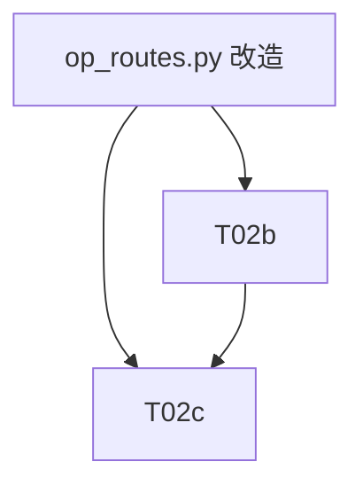

# 本地 dev 服务切到 AgentLoop 增量架构设计（T02）

> **输入**: team-lead 提供的现状与要求  
> **输出**: 设计文档（不写代码）  
> **版本**: v1.0  
> **日期**: 2026-09-12  
> **编写**: software-architect

---

## 1. 现状与目标

### 1.1 现状（已验证）

| 位置 | 现状 |
|------|------|
| `ai/core/agent/agent.py:63` | `ai_use_agent_loop` 默认 `True` |
| `ai/core/agent/agent.py:807-815` | `run()` 在 `ai_use_agent_loop` 为真时调用 `run_with_loop()` |
| `ai/tools/agent_tools.py:353-354` | `build_tool_schemas()` 已 extend `harness_tool_schemas()` |
| `ai/tools/agent_tools.py:1803-1805` | `make_handlers()` 已调用 `register_harness_handlers` + `register_mcp_handlers` |
| `ai/server/op_routes.py:156/220/251` | `api_chat_jobs_create` / `api_chat` / `api_chat_completions` 仍使用 `SimpleAgentLoop`，未复用生产 Agent |
| `ai/core/chat/runner.py:269-306` | 生产构造 `Agent` 并调用 `run()` 的路径 |
| `ai/server/op_routes.py` | `_make_dispatcher` 使用 `ToolDispatcher` + `SandboxPolicyService` + `AuditLog` + `HumanInLoop`，但生产 `Agent` 需要 `ToolPipeline`（`get_tool_handlers` 工厂） |
| `ai/tests/test_harness_enable.py` | 已覆盖 harness 工具 schema/handler 注册，但未断言 (a) `Agent.run` 默认走 loop，(b) `build_tool_schemas/make_handlers` 默认包含 harness 工具 |

### 1.2 目标

1. `ai/server/op_routes.py` 的本地 dev 路由优先复用生产 `Agent`（默认走 `AgentLoop`）。
2. 保留 `OfflineProvider` 用于本地 dev，Agent 构造/执行失败时 fallback 到 `SimpleAgentLoop`。
3. 新增最小辅助函数/工厂，使 `op_routes.py` 能构建与 `core/chat/runner.py` 等价但适合本地 dev 的 `Agent` 参数。
4. 补充回归测试：断言 `Agent.run` 默认走 loop、`build_tool_schemas/make_handlers` 默认包含 harness 工具。
5. 验证本地服务端到端可跑。

---

## 2. 架构设计

### 2.1 核心思路

将 `ai/server/op_routes.py` 中的 `_run_chat_local_dev` 从当前的 `SimpleAgentLoop` 优先路径，改为：

```text
_run_chat_local_dev
  ├─ try _run_with_agent(...)      # 生产 Agent + AgentLoop，使用 OfflineProvider
  │     ├─ 构造 Agent（复用 runner.py 同构参数）
  │     ├─ agent.run() 默认进入 run_with_loop()
  │     └─ 返回 {ok, agent, events}
  └─ except Exception -> _run_simple_loop(...)   # 兜底，保持本地 dev 不 hard-fail
```

关键改动：
- 用 `ai.tools.agent_tools.make_handlers` 替代当前 `_make_dispatcher` 的 `ToolDispatcher`，因为生产 `Agent` 内部已用 `ToolPipeline(get_tool_handlers())` 包装 handler。
- 用 `ai.tools.agent_tools.build_tool_schemas` 获取完整工具 schema（含 harness/skill/mcp）。
- 用 `OfflineProvider` 提供离线 LLM 能力，无需真实 API key。
- 复用 `AIConfig(provider="offline", model="offline-mock")`。
- 在 `_run_with_agent` 中显式注入 `ai_use_agent_loop=True` 到 `body`，并保证 `Agent.__init__` 的 `ai_use_agent_loop=True`。

### 2.2 新增辅助函数/工厂

#### `ai/server/op_routes.py` 内部新增

| 函数 | 职责 |
|------|------|
| `_make_agent_tool_pipeline(config)` | 调用 `build_tool_schemas()` 和 `make_handlers(...)`，返回 `(schemas, handlers)`；处理 `Params` 和 `StateReader` 的本地 dev 版本 |
| `_make_offline_provider_config()` | 返回 `AIConfig(provider="offline", model="offline-mock")` |
| `_run_with_agent(cwd, config, body, prompt, session_id)` | 改造现有函数：构造生产 `Agent`、注册到 `agent_registry`、调用 `agent.run()`、返回标准结果 |
| `_run_simple_loop(...)` | 保留现有 fallback，但降级使用 |
| `_run_chat_local_dev(...)` | 改造为 try Agent first，fallback simple loop |

#### `ai/core/chat/runner.py` 可能的轻量改动

| 改动 | 说明 |
|------|------|
| 新增 `build_agent_for_local_dev(...)` 或导出 `_TOOL_TIMEOUT_SECONDS` / `_LLM_STREAM_TIMEOUT_SECONDS` | 让 `op_routes.py` 与生产 runner 的参数来源一致，避免硬编码 magic number |
| 可选：把 `run_chat` 中的 Agent 构造逻辑抽成 `create_agent(...)` 工厂 | 提高复用性，但不强制 |

建议的最小侵入方案：**不改动 `runner.py`**，仅在 `op_routes.py` 内新增工厂函数并硬编码与 runner 一致的默认值；后续若参数漂移再统一抽取。

---

## 3. 需要修改/新增的文件列表

```
ai/
├── server/
│   ├── op_routes.py                 # 改造 _run_chat_local_dev / _run_with_agent，新增工厂函数
│   └── tests/
│       └── test_op_routes.py        # 新增：本地 dev Agent 构造与 fallback 测试
├── core/
│   ├── chat/
│   │   └── runner.py                # 可选：导出超时默认值或 create_agent 工厂
│   └── agent/
│       └── agent.py                 # 无需改动（现状已满足），但测试中需验证
├── tools/
│   └── agent_tools.py               # 无需改动（现状已满足），但测试中需验证
└── tests/
    └── test_harness_enable.py       # 新增/补充断言 (a)(b)
```

---

## 4. 数据流与调用时序图

### 4.1 本地 dev chat 调用链（改造后）

```mermaid
sequenceDiagram
    participant UI as Web UI / curl
    participant Route as ai/server/op_routes.py
    parameter Factory as _make_agent_tool_pipeline
    parameter AgentCls as ai.core.agent.agent.Agent
    parameter Registry as ai.core.agent.registry.agent_registry
    parameter Loop as AgentLoop
    parameter ToolReg as ai.tools.agent_tools
    parameter Fallback as _run_simple_loop

    UI->>Route: POST /api/chat {prompt, session_id, ...}
    Route->>Route: _run_chat_local_dev(cwd, config, body, prompt, session_id)

    Route->>Factory: _make_agent_tool_pipeline(config)
    Factory->>ToolReg: build_tool_schemas()
    ToolReg-->>Factory: schemas (含 harness + skill + mcp)
    Factory->>ToolReg: make_handlers(get_state_reader=..., params=Params())
    ToolReg-->>Factory: handlers
    Factory-->>Route: (schemas, handlers)

    Route->>AgentCls: Agent(..., ai_use_agent_loop=True, tools=schemas, get_tool_handlers=lambda: handlers)
    AgentCls-->>Route: agent
    Route->>Registry: agent_registry.resume(session_id, agent_id, job_id, cancel_fn)

    Route->>AgentCls: agent.run()
    AgentCls->>AgentCls: run_with_loop() [默认]
    AgentCls->>Loop: loop.run(prompt)
    Loop->>ToolReg: harness/skill/mcp tools
    ToolReg-->>Loop: results
    Loop-->>AgentCls: result
    AgentCls-->>Route: {ok: True, agent: result, events: events}

    alt Agent 构造/执行异常
        Route->>Fallback: _run_simple_loop(...)
        Fallback-->>Route: {ok: True, fallback: "simple_loop", result: result}
    end

    Route-->>UI: JSON response
```

### 4.2 `api_chat_completions` 改造后调用链

```mermaid
sequenceDiagram
    participant UI as Web UI
    participant Route as ai/server/op_routes.py
    parameter AgentCls as ai.core.agent.agent.Agent

    UI->>Route: POST /api/chat/completions {messages, session_id}
    Route->>Route: _extract_prompt(messages)
    Route->>Route: _run_chat_local_dev(cwd, config, body, prompt, session_id)
    Route->>AgentCls: Agent(...)
    AgentCls-->>Route: result
    Route->>Route: 包装成 OpenAI-compatible response
    Route-->>UI: chat.completion JSON / SSE
```

---

## 5. 任务分解

| Task ID | Task Name | Source Files | Dependencies | Priority |
|---------|-----------|--------------|--------------|----------|
| T02a | **op_routes.py 改造：复用生产 Agent/AgentLoop** | `ai/server/op_routes.py` | - | P0 |
| T02b | **回归测试补充** | `ai/tests/test_harness_enable.py`, `ai/server/tests/test_op_routes.py` | T02a | P0 |
| T02c | **本地服务端到端验证** | 手动运行 `python -m ai.server` + curl / web UI | T02a, T02b | P0 |

### 5.1 T02a 详细设计

**目标文件**: `ai/server/op_routes.py`

**改动点**:

1. **新增导入**（若尚未导入）:
   - `from ai.tools.agent_tools import build_tool_schemas, make_handlers`
   - `from ai.core.llm.client import AIConfig`
   - `from ai.core.agent.agent import Agent`
   - `from ai.core.agent.registry import agent_registry`
   - `from openpilot.common.params import Params`（或本地 dev 兼容的 mock）

2. **新增 `_make_agent_tool_pipeline(config)`**:
   - 调用 `build_tool_schemas()`
   - 构造 `get_state_reader`（复用现有 `_get_state_reader` 逻辑）
   - 调用 `make_handlers(get_state_reader=..., params=Params())`
   - 返回 `(schemas, handlers)`

3. **改造 `_run_with_agent(cwd, config, body, prompt, session_id)`**:
   - 移除当前使用 `ToolDispatcher` 的 `_make_dispatcher` 路径
   - 使用 `_make_agent_tool_pipeline(config)` 获取 schemas/handlers
   - 构造 `Agent` 时传入 `tools=schemas`、`get_tool_handlers=lambda: handlers`
   - 保持 `ai_use_agent_loop=True`
   - 保持 `agent_registry.resume` / `mark_done` 生命周期
   - 返回 `{ok: True, agent: result, events: events}`

4. **改造 `_run_chat_local_dev`**:
   - 当前逻辑：直接调用 `_run_with_agent`，异常时 fallback 到 `_run_simple_loop`
   - 已有 try/except 结构，基本不变，但需确保 `_run_with_agent` 真的能走 AgentLoop

5. **移除/保留 `_make_dispatcher`**:
   - `_make_dispatcher` 仅被 `_run_simple_loop` 使用，保留给 fallback
   - 若未来 SimpleAgentLoop 也支持 ToolPipeline，可再统一

### 5.2 T02b 详细设计

**目标文件 1**: `ai/tests/test_harness_enable.py`

**新增断言**:

```text
(a) Agent.run 默认走 loop
   - 已存在 test_agent_run_defaults_to_loop，但当前是显式传入 ai_use_agent_loop=True/False。
   - 应增加一个测试：默认构造（不传入 ai_use_agent_loop 参数，仅依赖 __init__ 默认值 True）时，run() 调用 run_with_loop。

(b) build_tool_schemas / make_handlers 默认包含 harness 工具
   - 已存在 test_build_tool_schemas_includes_harness / test_make_handlers_includes_harness，但它们只检查 goal_create/plan_generate/todo_write。
   - 应扩展为检查完整的 harness 工具集合：goal_create, plan_generate, todo_write, lsp, run_python_code，以及 mcp 相关 handler 是否注册（或至少不 crash）。
```

**目标文件 2**: `ai/server/tests/test_op_routes.py`（新增）

**测试用例**:

1. `test_run_chat_local_dev_uses_agent_loop`: mock `Agent.run` 或 `Agent.run_with_loop`，验证 `_run_chat_local_dev` 优先构造 `Agent`。
2. `test_run_chat_local_dev_fallback_to_simple_loop`: mock `Agent` 构造抛异常，验证返回 `fallback: "simple_loop"`。
3. `test_op_routes_agent_includes_harness_tools`: 验证 `_make_agent_tool_pipeline` 返回的 schemas 包含 harness 工具名。
4. `test_op_routes_agent_handler_includes_harness`: 验证 handlers 包含 `goal_create` 等 harness handler。

### 5.3 T02c 详细设计

**验证步骤**:

1. 启动本地服务：`python -m ai.server`（或项目约定的启动命令）。
2. 调用 `GET /api/health` 确认服务存活。
3. 调用 `POST /api/chat` 发送简单 prompt（如 `"hello"`），确认返回 `ok: True` 且结果来自 `AgentLoop`（可通过返回中的 `events` 或日志判断）。
4. 调用 `POST /api/chat/completions`，确认返回 OpenAI-compatible 格式。
5. 调用 `POST /api/chat/jobs` 创建 job，确认 job 复用 AgentLoop 路径。
6. 模拟 Agent 构造失败（临时改坏一个 import），验证 fallback 到 `SimpleAgentLoop` 且服务不 crash。
7. 跑回归测试：`pytest ai/tests/test_harness_enable.py ai/server/tests/test_op_routes.py -q`。

---

## 6. 待明确事项与风险

### 6.1 待明确事项

| 编号 | 问题 | 建议方案 |
|------|------|----------|
| Q1 | `Params()` 在本地 dev（非 AGNOS）是否可构造？ | 当前代码已使用 `Params()`，大概率可用；若不可行，需提供一个 `MockParams` 或从 `runner.py` 复用 |
| Q2 | `StateReader` 在本地 dev 是否可导入？ | 当前 `_run_with_agent` 已导入 `ai.selfdrive.state.StateReader`，大概率可用 |
| Q3 | `Agent` 构造失败时 fallback 的日志级别？ | 建议用 `logging.warning`，与现有代码一致 |
| Q4 | 是否保留 `_run_simple_loop` 长期存在？ | 建议保留作为本地 dev 兜底，直到生产 Agent 在本地 dev 稳定 |
| Q5 | `api_chat_completions` 的 SSE 是否也走 AgentLoop？ | 是，因为底层调用 `_run_chat_local_dev` |

### 6.2 风险

| 风险 | 影响 | 缓解措施 |
|------|------|----------|
| `make_handlers` 在本地 dev 依赖 `Params` 或 `StateReader`，可能 import 失败 | 本地 dev 服务无法启动 | fallback 到 `_run_simple_loop`；同时测试覆盖 import 失败路径 |
| `AgentLoop` 默认开启后，本地 dev 的行为可能与预期不一致（如多轮 tool call） | 本地调试体验变化 | 在返回结果中保留 `events` 列表，便于前端/开发者观察 |
| `build_tool_schemas` 注册的 skill/mcp 工具在本地 dev 可能调用真实外部服务 | 安全风险 | 本地 dev 默认沙箱模式仍为 `workspace_write`，高后果工具由 `HumanInLoop` / capability 控制 |
| 回归测试遗漏 `Agent.run` 默认走 loop | P0 验收失败 | 新增专门测试断言默认构造参数行为 |

---

## 7. 任务依赖图



---

*本文档为本地 dev 服务切到 AgentLoop 的增量架构设计，后续由 software-engineer 按 Task List 实施。*
